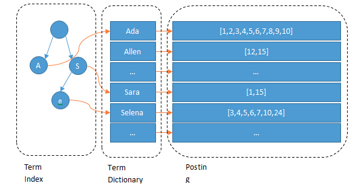
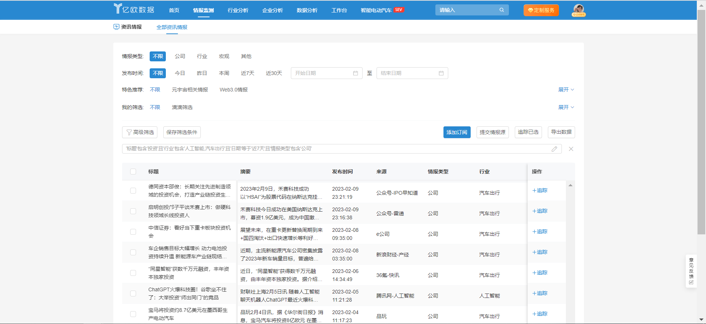
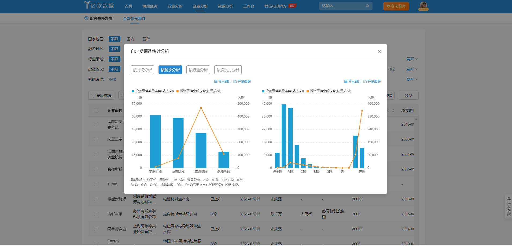
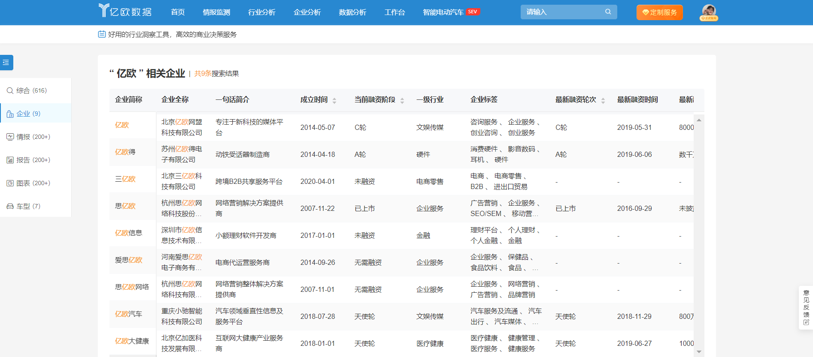
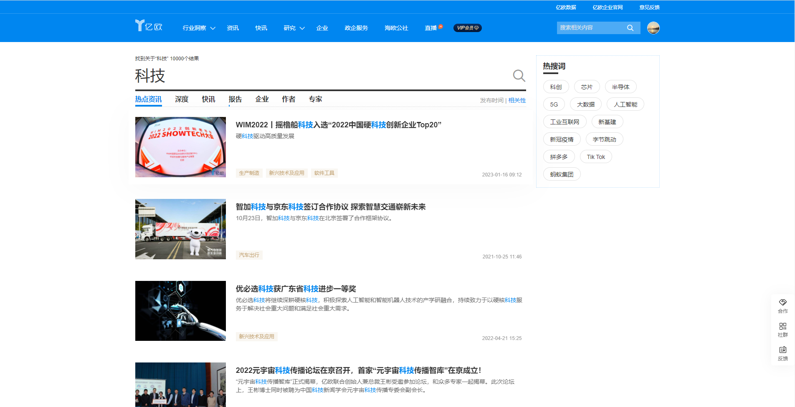

[Elasticsearch在亿欧的多场景应用实践](https://www.iyiou.com/news/202302241041883)

本文分享Elasticsearch的核心原理以及在亿欧平台的实践经验。

传统的关系型数据库在数据量达到百万级、千万级以上时，由于基于B+树的存储方式，导致磁盘IO急剧增加，性能迅速下降，同时RDBMS在进行聚合（sum/avg/count等）操作时，效率也较低，时间消耗比较多。而Elasticsearch则不同，基于Lucene提供分布式的全文检索功能，可以处理PB级数据量，采用倒排索引的存储方式，可以实现近实时的搜索，并且拥有秒级的响应速度。此外，Elasticsearch也能完成大部分复杂的分析场景，从而将自己从一个搜索引擎蜕变为一个完整的数据分析平台，能够实时进行海量聚合和多聚合操作，以达成预期的分析目标。

## Elasticsearch检索快的原因

传统关系型数据库Mysql，Postgres等以行的维度存储数据，我们称之为行存储，也就是同一行的数据在物理上存储在一起，当我们检索关键词时，需要扫描磁盘将每行数据加载到内存进行匹配，可以理解为通过key找到value。

与行存储的查询方式相反，通过value去找到key，Elasticsearch提前将关键词通过分词的方式提取出来作为Term，对每个Term建立倒排链表PostingList，所有的Term组成一个字典dictionary，并在内存中通过FST结构对TermDictionary进行编码存储了Term的前缀，构建出Term Index。

### 构建倒排索引

### 查询倒排链表

查询时先从内存中的Term Index获取到这个Term在磁盘Block的存储位置，将这个Block的字典TermDictionary读取到内存，快速定位到Term在字典中的offset，然后再基于这个位置进行顺序查找，对M个Term的检索时间复杂度为O(M*len(term))。

### 合并倒排链表

检索到所有Term的倒排链表PostingList，对这些PostingList进行合并操作，求并集，在Lucene中，使用Bitset作为合并的容器，遍历PostingList中的每个Id加入到合并容器中，合并M个Term的时间复杂度为O(K*M+log(K*M)),其中K为倒排链表的平均长度，倒排链合并的时间复杂度与Term的数量线性相关。

## Elasticsearch实际落地场景

### 多维度检索

在亿欧数据中是比较常见的业务场景，在高级检索模块，亿欧数据提供了基于标题、摘要、时间、行业、企业、类别等十多个维度的复合检索。同时还提供了基于term和match phrase的精准和分词的复杂嵌套查询方式。

### 图表分析

亿欧数据根据当前自定义的搜索条件，在大量数据中进行筛选，然后对过滤后的结果进行实时统计，能达到秒级响应，并能够按照多维度聚合，分析目标对象的走势情况。

### 全局搜索

不同于多维度检索场景，亿欧数据的全局搜索功能，需要权衡召回率和准确率（搜索体验量化的指标），需要对不同的字段设置不同的打分策略。比如给企业的简称设置更高的权重，给企业的全称和其他简称设置相对较低的权重。在以全文搜索的评分作为相关度的主要排序依据时，还可以将其他字段作为影响评分的因素，比如将企业的估值作为评分因子，估值高的企业更可能是用户想要的结果。

想要更好的搜索体验，一个合适的分词器必不可少，根据业务场景来选择分词器，没有适合所有业务场景的通用分词器，常见的中文分词器有IK、结巴、ANSJ，也有基于NLP的分词器如阿里云的AliNLP。亿欧数据的全局搜索要求力度更细，只要存在就召回，因此我们选择的是ngram分词，以空间换取时间的思想，在能够保证准确率的情况下，返回尽可能多的数据。

### 资讯搜索

基于Mysql的binlog日志，我们利用阿里开源的Canal同步工具，经过MQ消息队列实时的将增量资讯写入到Elasticsearch，对于Mysql中的新增、更新、删除操作，对应的Elasticsearch都能实时新增、更新、删除。构建好基础数据后，满足亿欧网的搜索功能。

搜索框的设计不容忽视，做好搜索体验对一个内容型产品是很重要的，我们在搜索资讯类相关信息时，更关注的往往是最近发生热门事件，希望搜索出来的结果在时间因素上越近越好，在进行全文检索的基础上，使用Elasticsearch的衰减函数对结果相关性进行了优化。

## 未来挑战

目前，亿欧平台已成功接入了大量高价值的数据到Elasticsearch中，主要包括情报资讯、公司企业、投资事件等。Elasticsearch作为亿欧平台基础设施中的重要组成部分，致力于提供海量的数据存储和高性能的搜索体验。随着版本的迭代，亿欧的业务增长，未来用户增多的同时会有更多的数据接入到Elasticsearch，要保证高并发、海量数据场景下的Elasticsearch实时聚合和检索能力，这是平台即将面临的挑战，路且远，道且长，亿欧技术团队为搜索服务护航。

