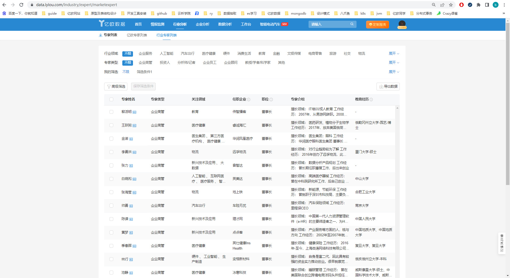

## 项目背景

亿欧数据行业专家列表的相关数据，来自亿欧网的专家库，以及其他来源，其中从亿欧网来源的专家，在es索引中字段crm_expert_id会存储对应的id，其他来源的数据该字段为空。每个专家有多份工作经历，采用nested结构存储在experience字段中。列表的查询规则是从亿欧网来源的专家展示在前面，同时按照工作经历中的职位进行排序，position表示职位等级，数字越小，职位越高

## 部分索引结构

```java
{
  "dp_person" : {
    "mappings" : {
      "properties" : {
		"crm_expert_id" : {
          "type" : "keyword"
        },
        "experience" : {
          "type" : "nested",
          "properties" : {
            "com_id" : {
              "type" : "keyword"
            },
            "full_name" : {
              "type" : "text",
              "fields" : {
                "keyword" : {
                  "type" : "keyword",
                  "ignore_above" : 256
                }
              }
            },
            "position" : {
              "type" : "integer"
            },
            "position_name" : {
              "type" : "text",
              "fields" : {
                "keyword" : {
                  "type" : "keyword",
                  "ignore_above" : 256
                }
              }
            },
            "work_intro" : {
              "type" : "text"
            }
          }
        }
      }
    }
  }
}
```

## 方案1

新增数据来源source字段，数据部门写入的时候进行赋值，排序时按照大小进行排序

## 方案2

新增数据来源source字段，可以利用reindex+script或者ingest方式，在重建索引的时候，根据crm_expert_id的值，设置source

## 方案3

新增数据来源source字段，利用update_by_query+script全量更新文档，设置source

## 方案4

前面三种方案都是新增source字段来实现需求的排序，查阅相关资料，可以利用script sort来进行排序，为了加快开发进度采用此种方案

```java
{
  "query": {
   "match_all": {}
  },
  "sort": [
    {
      "_script": {
        "script": {
          "source": "boolean flag=doc['crm_expert_id.keyword'].size()==0||doc['crm_expert_id.keyword'][0]=='';int rankScore =flag ?0: 1;return rankScore",
          "lang": "painless"
        },
        "type": "number",
        "order": "desc"
      }
    },
    {
      "experience.position": {
        "order": "asc",
        "unmapped_type": "int",
        "mode": "min",
        "nested": {
          "path": "experience"
        }
      }
    },
    "_doc"
  ]
}
```

当crm_expert_id为空时，参与排序的值为0，否则为1，再取nested结构中职位position最小的值进行排序，当crm_expert_id不为空/为空，position值相同，最后按照_doc进行排序

## 结果展示




## 拓展-如何实现固定数据置顶

elasticsearch提供了Pinned Query，可以将特定id的数据展示到搜索结果前面

* [Elasticsearch Pinned Query](https://www.elastic.co/guide/en/elasticsearch/reference/master/query-dsl-pinned-query.html)

## 参考

- [Elasticsearch Sort](https://www.elastic.co/guide/en/elasticsearch/reference/master/sort-search-results.html#script-based-sorting)
- [铭毅天下-搜索引擎广告置顶效果](https://mp.weixin.qq.com/s/9gaJwxTAxbL3YnAU8iXPpA)
- [铭毅天下-自定义评分](https://mp.weixin.qq.com/s/npOCOX8tTzk6bv_8n_7njQ)

