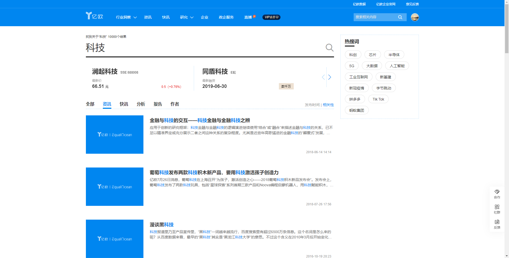
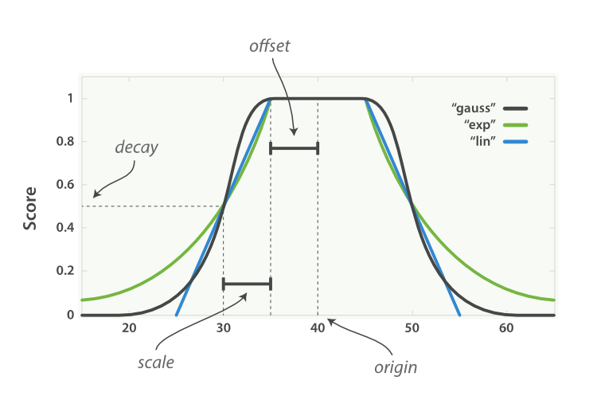

## 需求背景

亿欧网文章存储在elasticsearch，按照相关性搜索时，根据BM25计算得分后，搜索结果排名靠前的是时间比较旧的文章，因为相关度较高，但是用户更希望看到距当前时间较近的文章，也就是时间上越近越好。




## 方案

elasticsearch的function_score查询可以用来控制评分，并提供了一组衰减函数（linear线性,exp指数,gauss高斯函数）,可以操作数值，时间和地理坐标字段。因此我们搜索文章同时发布时间近的排在前面，可以引入基于时间的衰减函数，由于我们时间字段存储的是long型，需要转换成数值进行衰减。




### 简化dsl

```java
{
  "query": {
    "function_score": {
      "query": {
        "multi_match": {
          "query":  "科技",
          "fields": [ "title", "brief" ]
        }
      },
      "gauss" :{
          "pubdate": {
              "origin": 1671611518,
              "scale": 31104000,
              "offset": 31104000,
              "decay": 0.5
          }
       }
    }
  }
}
```

* origin

衰减函数中心，_score满分1.0，这里取当前时间戳1671611518精确到秒

* offset

以origin为中心点，设置偏移量，在范围 `-offset <= origin <= +offset` 内的所有评分 _score 都是 1.0

* scale

代表衰减的速率，评分_score改变的速度，代表离当前时间（offset+scale）评分衰减到decay的值

* decay

从原点 `origin` 衰减到 `scale` 所得的评分 `_score` ，默认值为 0.5

### 完整dsl

```java
{
  "explain": true,
  "_source": {
    "includes": [
      "title",
      "brief",
      "pubdate"
    ]
  },
  "from": 0,
  "size": 20,
  "query": {
    "function_score": {
      "query": {
        "bool": {
          "must": [
            {
              "term": {
                "type": {
                  "value": 1,
                  "boost": 1
                }
              }
            },
            {
              "terms": {
                "data_type": [
                  1,
                  2,
                  7
                ],
                "boost": 1
              }
            },
            {
              "term": {
                "status": {
                  "value": "1",
                  "boost": 1
                }
              }
            },
            {
              "range": {
                "pubdate": {
                  "from": null,
                  "to": 1671611518,
                  "include_lower": true,
                  "include_upper": false,
                  "boost": 1
                }
              }
            },
            {
              "multi_match": {
                "query": "科技",
                "fields": [
                  "brief.ik^3.0",
                  "title.ik^5.0"
                ],
                "type": "most_fields",
                "operator": "OR",
                "slop": 0,
                "prefix_length": 0,
                "max_expansions": 50,
                "zero_terms_query": "NONE",
                "auto_generate_synonyms_phrase_query": true,
                "fuzzy_transpositions": true,
                "boost": 1
              }
            }
          ],
          "adjust_pure_negative": true,
          "boost": 1
        }
      },
      "functions": [
        {
          "filter": {
            "match_all": {
              "boost": 1
            }
          },
          "gauss": {
            "pubdate": {
              "origin": 1671611518,
              "scale": 31104000,
              "offset": 31104000,
              "decay": 0.5
            },
            "multi_value_mode": "MIN"
          }
        }
      ],
      "score_mode": "sum",
      "boost_mode": "multiply",
      "max_boost": 3.4028235e+38,
      "boost": 1
    }
  },
  "sort": [
    {
      "_score": {
        "order": "desc"
      }
    }
  ],
  "highlight": {
    "pre_tags": [
      "<em>"
    ],
    "post_tags": [
      "</em>"
    ],
    "fragment_size": 300,
    "fields": {
      "title.ik": {},
      "brief.ik": {}
    }
  }
}
```


## 优化后效果


## 参考

- [Elasticsearch权威指南-控制相关度](https://www.elastic.co/guide/cn/elasticsearch/guide/current/decay-functions.html)

