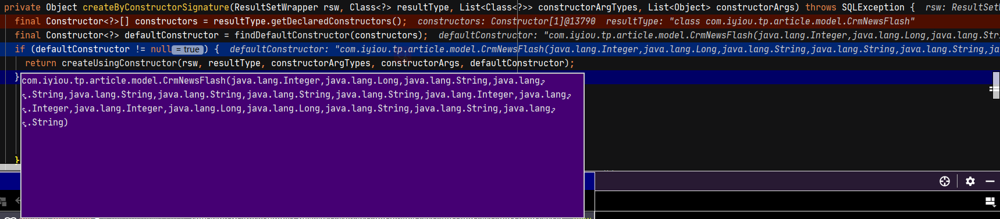

## 现象

Mybatis查询结果返回对result进行封装时，出现异常

sql语句：SELECT id FROM crm_news_flash WHERE (status = ? AND pubdate <= ?) LIMIT ?

```java
org.mybatis.spring.MyBatisSystemException: nested exception is org.apache.ibatis.exceptions.PersistenceException: 
### Error querying database.  Cause: java.lang.IndexOutOfBoundsException: Index 1 out of bounds for length 1
### The error may exist in com/iyiou/tp/article/repo/CrmNewsFlashRepo.java (best guess)
### The error may involve com.iyiou.tp.article.repo.CrmNewsFlashRepo.selectPage
### The error occurred while handling results
### SQL: SELECT   id   FROM crm_news_flash     WHERE (status = ? AND pubdate <= ?) LIMIT ?
### Cause: java.lang.IndexOutOfBoundsException: Index 1 out of bounds for length 1
	at org.mybatis.spring.MyBatisExceptionTranslator.translateExceptionIfPossible(MyBatisExceptionTranslator.java:96) ~[mybatis-spring-2.0.6.jar:2.0.6]
	at org.mybatis.spring.SqlSessionTemplate$SqlSessionInterceptor.invoke(SqlSessionTemplate.java:441) ~[mybatis-spring-2.0.6.jar:2.0.6]
	at com.sun.proxy.$Proxy114.selectList(Unknown Source) ~[na:na]
	at org.mybatis.spring.SqlSessionTemplate.selectList(SqlSessionTemplate.java:224) ~[mybatis-spring-2.0.6.jar:2.0.6]
	at com.baomidou.mybatisplus.core.override.MybatisMapperMethod.executeForIPage(MybatisMapperMethod.java:121) ~[mybatis-plus-core-3.4.3.jar:3.4.3]
	at com.baomidou.mybatisplus.core.override.MybatisMapperMethod.execute(MybatisMapperMethod.java:85) ~[mybatis-plus-core-3.4.3.jar:3.4.3]
	at com.baomidou.mybatisplus.core.override.MybatisMapperProxy$PlainMethodInvoker.invoke(MybatisMapperProxy.java:148) ~[mybatis-plus-core-3.4.3.jar:3.4.3]
	at com.baomidou.mybatisplus.core.override.MybatisMapperProxy.invoke(MybatisMapperProxy.java:89) ~[mybatis-plus-core-3.4.3.jar:3.4.3]
	at com.sun.proxy.$Proxy152.selectPage(Unknown Source) ~[na:na]
	at com.iyiou.tp.article.service.impl.NewsFlashServiceImpl.getTimedNewsIds(NewsFlashServiceImpl.java:881) ~[classes/:na]
```

## 实体类CrmNewsFlash

```java
@Data
@EqualsAndHashCode(callSuper = false)
@Accessors(chain = true)
@TableName("crm_news_flash")
@Builder
public class CrmNewsFlash implements Serializable {

    private static final long serialVersionUID = 1L;

    @TableId(value = "id", type = IdType.AUTO)
    private Integer id;

    /**
     * 发布时间
     */
    private Long pubdate;

    /**
     * 标题
     */
    private String title;

    /**
     * 内容
     */
    private String content;


    /**
     * 新闻源名称
     */
    private String source;

    /**
     * 链接
     */
    private String link;

    /**
     * 封面图片
     */
    private String cover;

    /**
     * 等级
     */
    private String grade;

    /**
     * 创建人 ID
     */
    private Integer mid;

    /**
     * 最后更新用户 ID
     */
    private Integer lastMid;

    /**
     * 状态（-3.撤回删除 -2.草稿删除 -1.发布删除 1.发布 2.草稿 3.撤回）
     * //需要跟文章报告的状态统一
     */
    private Integer status;

    /**
     * 创建时间
     */
    private Long createTime;

    /**
     * 修改时间
     */
    private Long updateTime;

    /**
     * 来源
     */
    private String dataSource;

    /**
     * 原始表中id
     */
    private String sourceId;

    /**
     * 删除理由
     */
    private String delReason;


}
```

## DefaultResultSetHandler#createByConstructorSignature

通过构造器创建对象

```java
 private Object createByConstructorSignature(ResultSetWrapper rsw, Class<?> resultType, List<Class<?>> constructorArgTypes, List<Object> constructorArgs) throws SQLException {
     //拿到所有的构造方法
    final Constructor<?>[] constructors = resultType.getDeclaredConstructors();
     //获取默认无参构造方法,此处defaultConstructor返回的是一个全参构造方法
    final Constructor<?> defaultConstructor = findDefaultConstructor(constructors);
    if (defaultConstructor != null) {
      return createUsingConstructor(rsw, resultType, constructorArgTypes, constructorArgs, defaultConstructor);
    } else {
      for (Constructor<?> constructor : constructors) {
        if (allowedConstructorUsingTypeHandlers(constructor, rsw.getJdbcTypes())) {
          return createUsingConstructor(rsw, resultType, constructorArgTypes, constructorArgs, constructor);
        }
      }
    }
    throw new ExecutorException("No constructor found in " + resultType.getName() + " matching " + rsw.getClassNames());
  }
```


## 使用的全参构造器defaultConstructor



## DefaultResultSetHandler#createUsingConstructor

```java
  private Object createUsingConstructor(ResultSetWrapper rsw, Class<?> resultType, List<Class<?>> constructorArgTypes, List<Object> constructorArgs, Constructor<?> constructor) throws SQLException {
    boolean foundValues = false;
    for (int i = 0; i < constructor.getParameterTypes().length; i++) {
      Class<?> parameterType = constructor.getParameterTypes()[i];
      String columnName = rsw.getColumnNames().get(i);
      TypeHandler<?> typeHandler = rsw.getTypeHandler(parameterType, columnName);
      Object value = typeHandler.getResult(rsw.getResultSet(), columnName);
      constructorArgTypes.add(parameterType);
      constructorArgs.add(value);
      foundValues = value != null || foundValues;
    }
    return foundValues ? objectFactory.create(resultType, constructorArgTypes, constructorArgs) : null;
  }
```


由于用的是全参构造器，会对每个属性赋值，但是sql查询的结果ResultSetWrapper中的列columnNames只有id，因此出现异常：Cause: java.lang.IndexOutOfBoundsException: Index 1 out of bounds for length 1

## 解决

添加无参构造方法

```java
@Data
@EqualsAndHashCode(callSuper = false)
@Accessors(chain = true)
@TableName("crm_news_flash")
@Builder
@NoArgsConstructor
@AllArgsConstructor
public class CrmNewsFlash implements Serializable
```