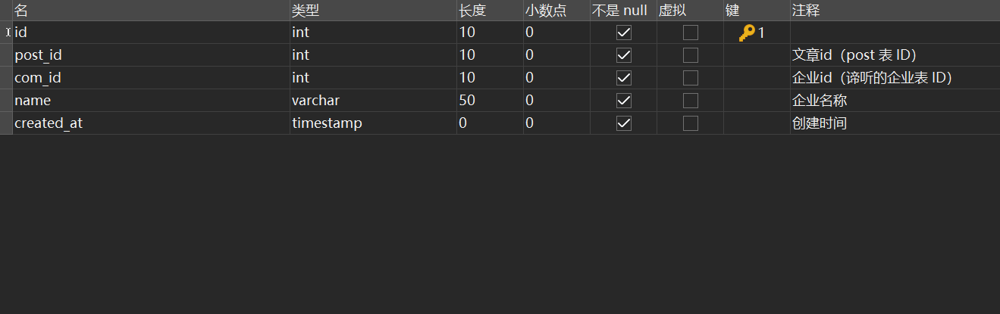
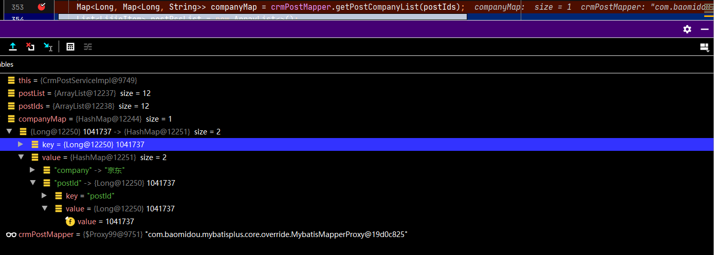
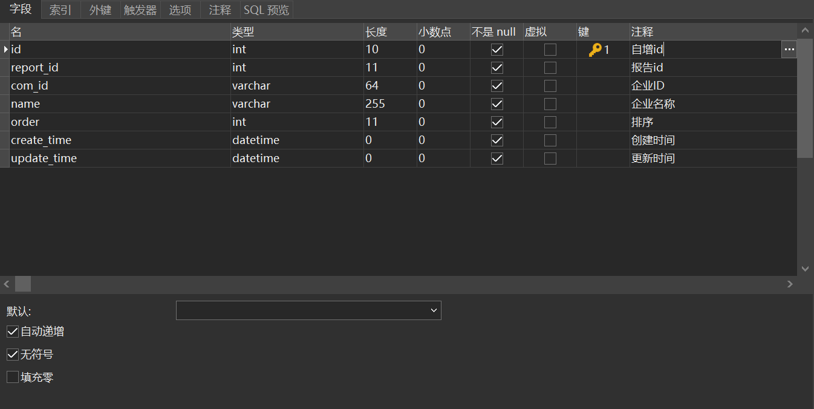
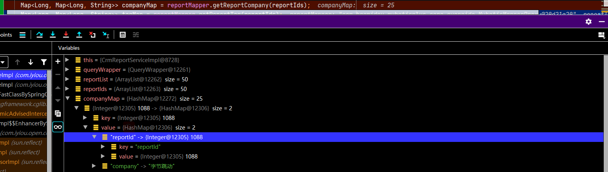
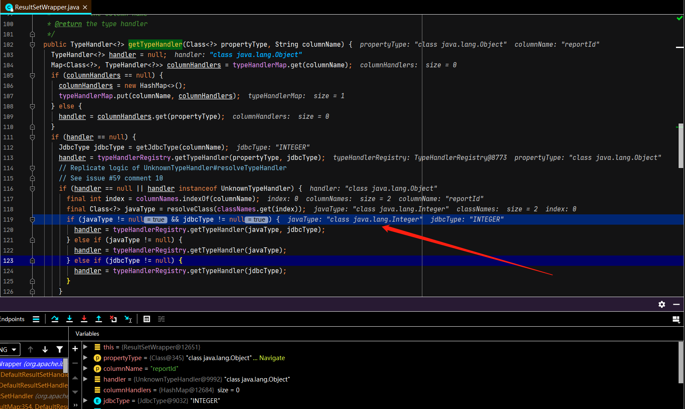
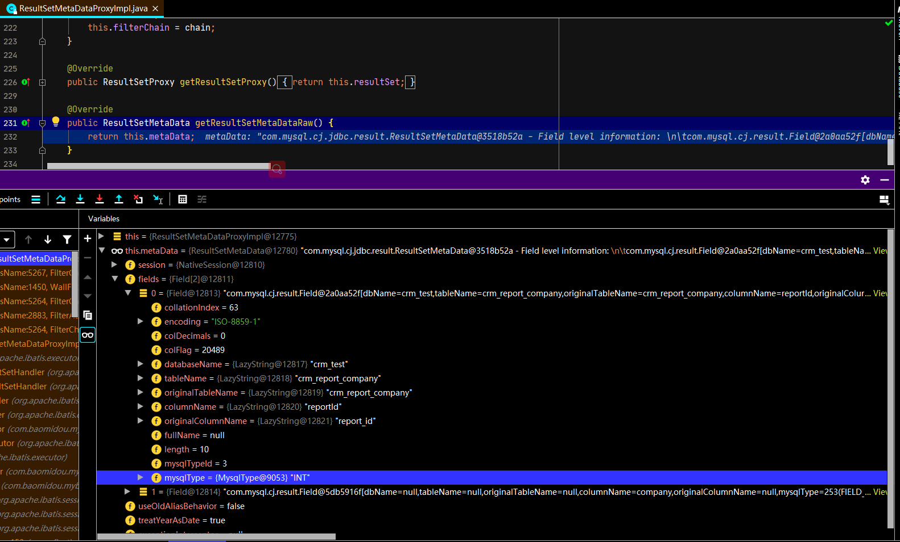
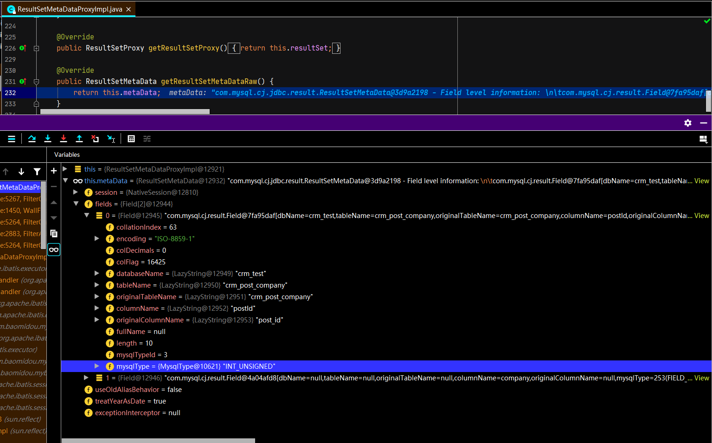
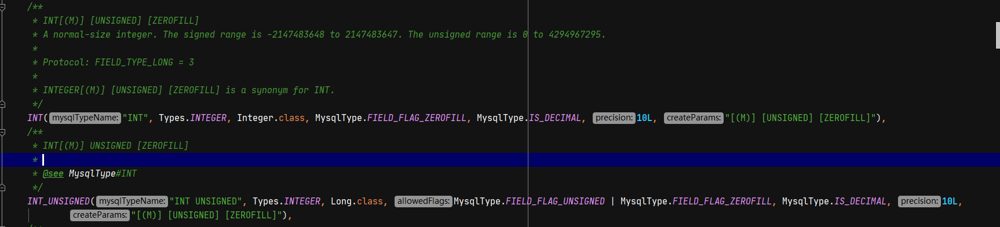

## 背景

同样的查询语句，映射的类型不一样

## 查询文章关联企业

### mapper语句

```java
@MapKey("postId")
Map<Long, Map<Long,String>> getPostCompanyList(@Param("postIds") List<Long> postIds);
```


### sql语句

```sql
    SELECT
    post_id as postId ,
    GROUP_CONCAT(name SEPARATOR ',' ) AS company
    FROM
    crm_post_company
    WHERE
    post_id IN
    <foreach collection="postIds" item="id" separator="," close=")" open="(">
      #{id}
    </foreach>
    GROUP BY
    post_id
```

### 表结构



### 实际映射




## 查询报告关联企业

### mapper语句

```java
@MapKey("reportId")
Map<Long, Map<Long,String>> getReportCompany(@Param("reportIds")List<Long>reportIds);
```


### sql语句

```sql
    SELECT
    report_id as reportId,
    GROUP_CONCAT( name SEPARATOR ',' ) AS company
    FROM
    crm_report_company
    WHERE
    report_id IN
    <foreach collection="reportIds" item="id" separator="," close=")" open="(">
      #{id}
    </foreach>
    GROUP BY
    report_id
```

### 表结构




### 实际映射不一样




## 源码调试

### DefaultResultSetHandler#createAutomaticMappings

结果集映射

```java
private List<UnMappedColumnAutoMapping> createAutomaticMappings(ResultSetWrapper rsw, ResultMap resultMap, MetaObject metaObject, String columnPrefix) throws SQLException {
    final String mapKey = resultMap.getId() + ":" + columnPrefix;
    List<UnMappedColumnAutoMapping> autoMapping = autoMappingsCache.get(mapKey);
    if (autoMapping == null) {
        autoMapping = new ArrayList<>();
        final List<String> unmappedColumnNames = rsw.getUnmappedColumnNames(resultMap, columnPrefix);
        for (String columnName : unmappedColumnNames) {
            String propertyName = columnName;
            if (columnPrefix != null && !columnPrefix.isEmpty()) {
                // When columnPrefix is specified,
                // ignore columns without the prefix.
                if (columnName.toUpperCase(Locale.ENGLISH).startsWith(columnPrefix)) {
                    propertyName = columnName.substring(columnPrefix.length());
                } else {
                    continue;
                }
            }
            final String property = metaObject.findProperty(propertyName, configuration.isMapUnderscoreToCamelCase());
            if (property != null && metaObject.hasSetter(property)) {
                if (resultMap.getMappedProperties().contains(property)) {
                    continue;
                }
                final Class<?> propertyType = metaObject.getSetterType(property);
                //类型映射
                if (typeHandlerRegistry.hasTypeHandler(propertyType, rsw.getJdbcType(columnName))) {
                    final TypeHandler<?> typeHandler = rsw.getTypeHandler(propertyType, columnName);
                    autoMapping.add(new UnMappedColumnAutoMapping(columnName, property, typeHandler, propertyType.isPrimitive()));
                } else {
                    configuration.getAutoMappingUnknownColumnBehavior()
                        .doAction(mappedStatement, columnName, property, propertyType);
                }
            } else {
                configuration.getAutoMappingUnknownColumnBehavior()
                    .doAction(mappedStatement, columnName, (property != null) ? property : propertyName, null);
            }
        }
        autoMappingsCache.put(mapKey, autoMapping);
    }
    return autoMapping;
}
```

### ResultSetWrapper#getTypeHandler

获取每个字段对应的类型处理类 typeHander

```java
public TypeHandler<?> getTypeHandler(Class<?> propertyType, String columnName) {
    TypeHandler<?> handler = null;
    Map<Class<?>, TypeHandler<?>> columnHandlers = typeHandlerMap.get(columnName);
    if (columnHandlers == null) {
        columnHandlers = new HashMap<>();
        typeHandlerMap.put(columnName, columnHandlers);
    } else {
        handler = columnHandlers.get(propertyType);
    }
    if (handler == null) {
        JdbcType jdbcType = getJdbcType(columnName);
        handler = typeHandlerRegistry.getTypeHandler(propertyType, jdbcType);
        // Replicate logic of UnknownTypeHandler#resolveTypeHandler
        // See issue #59 comment 10
        if (handler == null || handler instanceof UnknownTypeHandler) {
            final int index = columnNames.indexOf(columnName);
            final Class<?> javaType = resolveClass(classNames.get(index));
            if (javaType != null && jdbcType != null) {
                handler = typeHandlerRegistry.getTypeHandler(javaType, jdbcType);
            } else if (javaType != null) {
                handler = typeHandlerRegistry.getTypeHandler(javaType);
            } else if (jdbcType != null) {
                handler = typeHandlerRegistry.getTypeHandler(jdbcType);
            }
        }
        if (handler == null || handler instanceof UnknownTypeHandler) {
            handler = new ObjectTypeHandler();
        }
        columnHandlers.put(propertyType, handler);
    }
    return handler;
}
```


reportId类型映射javaType是Integer，我们得找到最开始初始化时classNames的赋值地方



### ResultSetMetaData

### reportId对应的MysqlType

从这里我们找到了reportId的MysqlType被映射成了INT，此时我们对比下postId的MysqlType会被映射成什么？



### postId对应的MysqlType

发现postId的MysqlType为INT_UNSIGNED，此时答案就揭晓了，不难推测出，表结构不一样，crm_post_company中的post_id为无符号整数类型，会被映射成Long




### 枚举类型 MysqlType#MysqlType

```java
private MysqlType(String mysqlTypeName, int jdbcType, Class<?> javaClass, int allowedFlags, boolean isDec, Long precision, String createParams) {
    this.name = mysqlTypeName;
    this.jdbcType = jdbcType;
    this.javaClass = javaClass;
    this.flagsMask = allowedFlags;
    this.isDecimal = isDec;
    this.precision = precision;
    this.createParams = createParams;
}
```





## 总结

* INT映射成Integer.class
* INT_UNSIGNED映射成Long.class
* Java中的泛型伪泛型