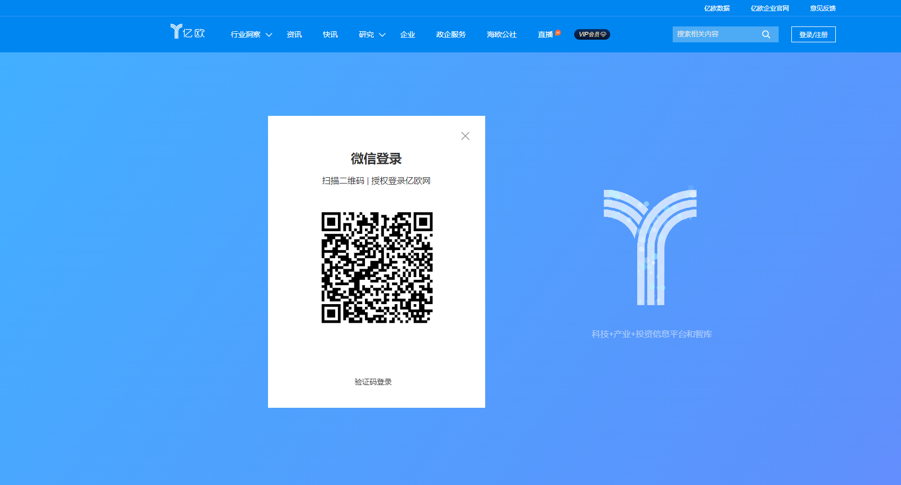

## 微信登录

亿欧网接入微信登录，采用授权码的模式，从微信获取到用户头像、昵称、性别等个人信息，若之前没在亿欧网登录过，自动在亿欧网上自动注册新的用户。

### 步骤

* 微信管理后台注册应用相关信息（名称、域名、回调地址），拿到app_id和和app_secret

* 后端提供二维码登录地址

  ```java
  public String getWxWebLoginUrl() {
      return WeChatConstants.OPEN_URL + WeChatConstants.API_QRCONNECT_URL + "?appid=" +
          WeChatConstants.APP_ID_LOGIN + "&redirect_uri=" +
          WeChatConstants.CALLBACK + "&response_type=code" + "&scope=snsapi_login";
  }
  ```



* 扫码授权登录后，微信会携带code，回调配置的前端地址，然后前端拿着code来获取用户信息，后端通过code拿到access_token，再通过access_token拿到微信用户信息，然后进行登录相关操作。

  

  ```java
  /**
     * 获取登录accessToken
     *
     * @param code code
     * @param type PC登录为1，H5登录为2
     * @return JsonObject
     */
  public WeChatAuthorizeLoginResponse getLoginAccessToken(String code, Integer type) {
      String appId =WeChatConstants.APP_ID_LOGIN ;
      String secret = WeChatConstants.APP_SECRET_LOGIN;
      switch (type){
          case 2:
              appId= WeChatConstants.APP_ID;
              secret=WeChatConstants.APP_SECRET;
              break;
          case 3:
              appId= WeChatConstants.APP_ID_APP_IOS;
              secret=WeChatConstants.APP_SECRET_APP_IOS;
              break;
          case 4:
              appId= WeChatConstants.APP_ID_APP_Android;
              secret=WeChatConstants.APP_SECRET_APP_Android;
              break;
      }
      String url = getUrl() + WeChatConstants.WE_CHAT_AUTHORIZE_GET_OPEN_ID +
          "?appid=" + appId +
          "&secret=" + secret +
          "&code=" + code +
          "&grant_type=authorization_code";
      JSONObject result = get(url);
      return JSON.parseObject(result.toJSONString(), WeChatAuthorizeLoginResponse.class);
  }
  ```

  ```java
  /**
     * 获取微信用户个人信息
     *
     * @param openId String code换取的openId
     * @param token String code换取的token
     * @return WeChatUserInfoResponse
     */
  @Override
  public WeChatUserInfoResponse getUserInfo(String openId, String token) {
      String url = getUrl() + WeChatConstants.WE_CHAT_AUTHORIZE_GET_USER_INFO +
          "?access_token=" + token +
          "&openid=" + openId +
          "&lang=zh_CN";
      JSONObject result = get(url);
      return JSONObject.parseObject(result.toJSONString(), WeChatUserInfoResponse.class);
  }
  ```

  ```java
  /**
     * 根据code去获取用户相关信息
     *
     * @param code 扫码登录后返回的code
     * @param type PC登录为1，H5登录为2
     * @return LoginResponse
     */
  public LoginResponse getUserLoginInfo(String code, Integer type) {
      WeChatAuthorizeLoginResponse weChatResponse = getLoginAccessToken(code, type);
      //没有注册， 获取微信用户信息
      WeChatUserInfoResponse weChatUser = getUserInfo(weChatResponse.getOpenId(),
                                                      weChatResponse.getAccessToken());
      User userByUnionId = userService.getUserByUnionId(weChatUser.getUnionId());
  
      if (userByUnionId == null) {
          String regTime = DateHelper.currentTimeMillisCN1();
          User user = new User();
          user.setNickName(weChatUser.getNickName());
          user.setWeixinOpenid(weChatResponse.getOpenId());
          user.setWeixinUnionid(weChatUser.getUnionId());
          user.setUserId(IyiouUtil.getMd5(weChatUser.getUnionId() + regTime));
          user.setStatus(UserConstants.USER_STATUS_FORBIDDEN);
          user.setAvatar(uploadAvatar(weChatUser.getAvatar()));
          user.setGender(Integer.parseInt(weChatUser.getSex()));
          user.setRegTime(regTime);
          user.setWeixinNickname(weChatUser.getNickName());
          userService.saveUser(user);
      }
  
      if (userByUnionId != null && StringUtils.isNotEmpty(userByUnionId.getMobile())) {
          //更新用户登录时间
          RegisterRequest request = new RegisterRequest();
          request.setUserId(userByUnionId.getUserId());
          userService.upUser(request);
          return userService.setJwtToken(userByUnionId);
      } else {
          LoginResponse loginResponse = new LoginResponse();
          User user = new User();
          user.setWeixinUnionid(weChatUser.getUnionId());
          loginResponse.setUser(user);
          return loginResponse;
      }
  }
  ```

  

## 参考

[OAuth](https://javaguide.cn/system-design/security/basis-of-authority-certification.html#%E4%BB%80%E4%B9%88%E6%98%AF-oauth-2-0)