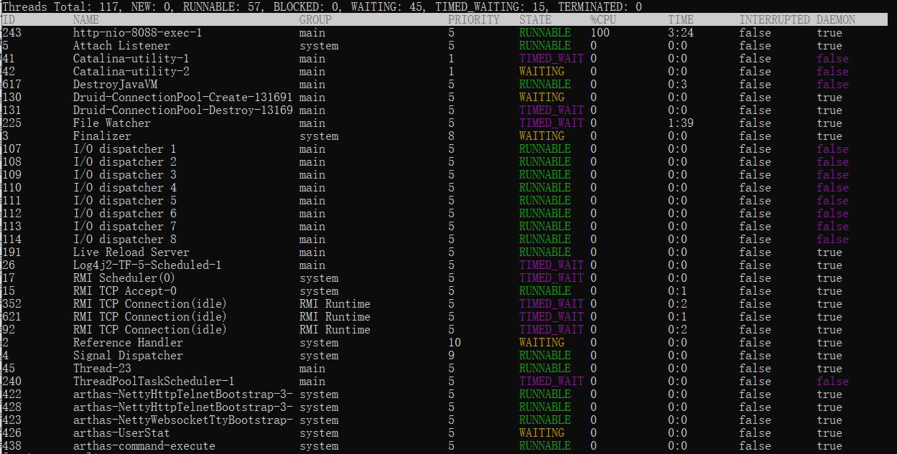
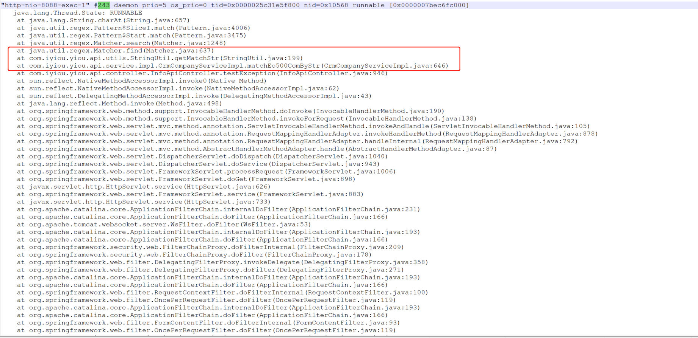

## 起源

周末跟朋友探讨时，用户使用他们系统，用excel导入数据时，出现了cpu100%的问题，后面定位到问题是导入程序的代码中对每个单元格重复执行trim和contains方法。让我也想起了很早之前亿欧网线上出现的一次cpu 100%问题，访问网站迟迟没有响应。

## 追忆

当时定位到问题还是比较快的，系统也上了阿里云ARMS监控，从监控上看到CPU 100%，直接登上服务器将JVM进程栈的日志dump下来（机器上只部署了亿欧网应用），看到http的几个请求线程都卡在某个方法上，去程序中看了下代码，是其他同事对文章的内容进行一些正则匹配的操作，当时的业务是，在文章内容中提取出一批关键词企业，对这些企业添加<a>标签，然后更新文章内容，这样在网站显示的时候能够点击这些企业进行跳转。

```java
 /**
   * 详情匹配eo500企业
   *
   * @param content String
   * @return String
   */
  @Override
  public String matchEo500ComByStr(String content) throws ParseException {
    if (EmptyHelper.isNotEmpty(content)) {
      //匹配a标签放入map
      Map<String, String> strMap = new HashMap<>();
      Matcher m = Pattern.compile(RegularConstants.HTML_A).matcher(content);
      int mi = 0;
      while (m.find()) {
        String filepath = m.group(0);
        //content里的a标签临时替换
        content = content.replace(filepath, YiouConstants.IYIOU_HTML_A_KEY + mi + "]");
        strMap.put(YiouConstants.IYIOU_HTML_A_KEY + mi + "]", filepath);
        mi = mi + 1;
      }
      List<CrmCompanyInfoVO> eo500ComList = listEo500Company(false);
      List<CrmCompanyInfoVO> comMatchList = new ArrayList<>();
      if (EmptyHelper.isNotEmpty(eo500ComList)) {
        for (CrmCompanyInfoVO com : eo500ComList) {
          String str = StringUtil
              .getMatchStr(content, com.getBriefName(), Pattern.CASE_INSENSITIVE);
          if (str != null && !str.equals("")) {
            comMatchList.add(com);
          }
        }
      }
      comMatchList = comMatchList.stream().sorted(
          Comparator.comparing(CrmCompanyInfoVO::getBriefName).reversed()
      ).collect(
          Collectors.toList());
      List<CrmCompanyInfoVO> comUsedList = new ArrayList<>();
      List<String> nameList = new ArrayList<>();
      if (EmptyHelper.isNotEmpty(comMatchList)) {
        int num = comMatchList.size();
        for (int i = 0; i < num; i++) {
          CrmCompanyInfoVO thisCom = comMatchList.get(i);
          String thisName = thisCom.getBriefName();
          for (CrmCompanyInfoVO com : comMatchList) {
            if (nameList.contains(thisName)) {
              continue;
            }
            if (!com.getBriefName().equals(thisName)) {
              String str = StringUtil.getMatchStr(
                  com.getBriefName(), thisName, Pattern.CASE_INSENSITIVE
              );
              if (str != null && !str.equals("")) {
                break;
              }
            }
            comUsedList.add(thisCom);
            nameList.add(thisName);
            content = content.replace(thisCom.getBriefName(), "&" + thisCom.getComId() + "&");
          }
        }
      }
      if (EmptyHelper.isNotEmpty(comUsedList)) {
        for (CrmCompanyInfoVO repCom : comUsedList) {
          content = content.replaceFirst("&" + repCom.getComId() + "&",
              "<a href='/company/" + repCom.getBriefDomain() + "'>"
                  + repCom.getBriefName() + "</a>");
          content = content.replace("&" + repCom.getComId() + "&", repCom.getBriefName());
        }
      }
      if (EmptyHelper.isNotEmpty(strMap)) {//便利a标签map并还原
        for (Map.Entry<String, String> entry4 : strMap.entrySet()) {
          String key = entry4.getKey();
          String value = entry4.getValue();
          content = content.replace(key, value);
        }
      }
    }

    return content;
  }
```


## 为什么之前没有出现问题

当时定位到程序会对内容进行正则匹配，但是疑惑点是为什么之前一直没出现问题，最近那几天也没有版本上线操作。然后我就去看看是什么样的文章内容正则匹配会这么耗时，打开navicat，连上数据库查看文章表，此时卡住了...过了好几秒才返回结果，找到最新的几篇文章，发现其中一篇文章内容长度大的离谱，两百多万字，也就难怪正则匹配匹配耗时那么长时间了。

## 问题处理

1. 将那篇文章下架
2. 分析那篇文章类型为转载，转载服务根据链接地址提取出内容时异常。（具体原因没深究，那篇文章内容标签后面有一大部分脏数据）
3. 后续跟产品沟通，将文章内容需要匹配出企业的逻辑，放到后台异步操作。后续版本迭代时，这部分功能已完全替换

## 本地复现

### arthas查看top 线程




### jstack 根据线程id找到日志

如果是在linux中根据top -H -p pid找到的线程id，转换成十六进制的线程id，对应为jstack日志中的 nid。

而此处可以根据arthas中显示的线程id（#243）进行查找

