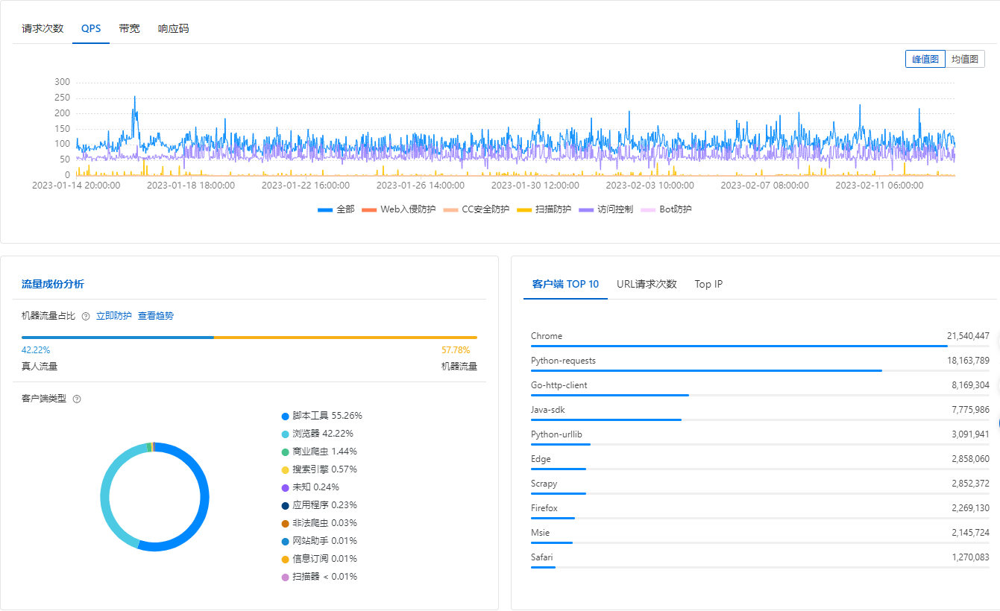
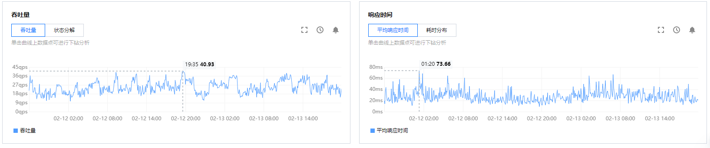

## 配置

* 两台4c/8g服务器通过SLB负载均衡

* 新生代2g(1.6g+0.2g+0.2g)，老年代1g

  ```java
  -Xms3072M                                        内存大小
  -Xmx3072M                                        内存最大值
  -Xmn2048M                                        年轻代大小
  -XX:SurvivorRatio=8								 年轻代比例
  -XX:MetaspaceSize=256M                           永久代初始大小
  -XX:MaxMetaspaceSize=256M                        永久代最大值
  -XX:+UseParNewGC						         新生代并行回收器 
  -XX:+UseConcMarkSweepGC   						 老年代CMS收集器
  -XX:+PrintGCDetails 						     打印gc日志
  -XX:+PrintGCDateStamps                           打印gc时间
  -Xloggc:gc.log								     gc日志存放路径
  -XX:+HeapDumpOnOutOfMemoryError					 程序崩溃dump内存
  -XX:HeapDumpPath=/user/local/app/oom			 oom文件存放地址-文件夹必须存在
  
  //下面参数线上未配置
  -XX:CMSInitiatingOccupancyFraction=92 			 老年代指定阈值回收
  -XX:+UseCMSCompactAtFullCollection				 回收后整理
  -XX:CMSFullGCsBeforeCompaction=0 				 每次回收后压缩
  -XX+UseCMSInitiatingOccupancyOnly				 老年代回收设定
  -XX:+CMSParallelInitialMarkEnabled				 初始标记多线程执行减少STW
  ```


## 线上GC情况

每分钟大概五千左右的请求，一台机器处理两千左右请求/每秒30-40个请求，一台机器每秒产生100-150M对象，每次请求产生3M-5M请求，每次ygc剩余20-30M对象，10s左右一次ygc

### 进入老年代条件

* 一个对象在年轻代里躲过15次垃圾回收，年龄太大了，寿终正寝，进入老年代

* 对象太大了，超过了一定的阈值，直接进入老年代，不走年轻代

* 一次Young GC过后存活对象太多了，导致Survivor区域放不下了，这批对象会进入老年代

* 可能几次Young GC过后，Surviovr区域中的对象占用了超过50%的内存，此时会判断如果年龄1+年龄2+年龄N的对象总和超过了Survivor区域的50%，此时年龄N以及之上的对象都进入老年代，这是动态年龄判定规则

### FGC条件

* 老年代自身可以设置一个阈值，有一个JVM参数可以控制，一旦老年代内存使用达到这个阈值，就会触发Full GC，一般建议调节大一些，比如92%

* 在执行Young GC之前，如果判断发现老年代可用空间小于了历次Young GC后升入老年代的平均对象大小的话，那么就会在Young GC之前触发Full GC，先回收掉老年代一批对象，然后再执行Young GC

* 如果Young GC过后的存活对象太多，Survivor区域放不下，就要放入老年代，要是此时老年代也放不下，就会触发Full GC，回收老年代一批对象，再把这些年轻代的存活对象放入老年代中


## 吞吐量与响应时间

爬虫没有被禁之前有200-300qps




上了WAF防火墙后，降到20-50qps，响应时间基本50ms以内

