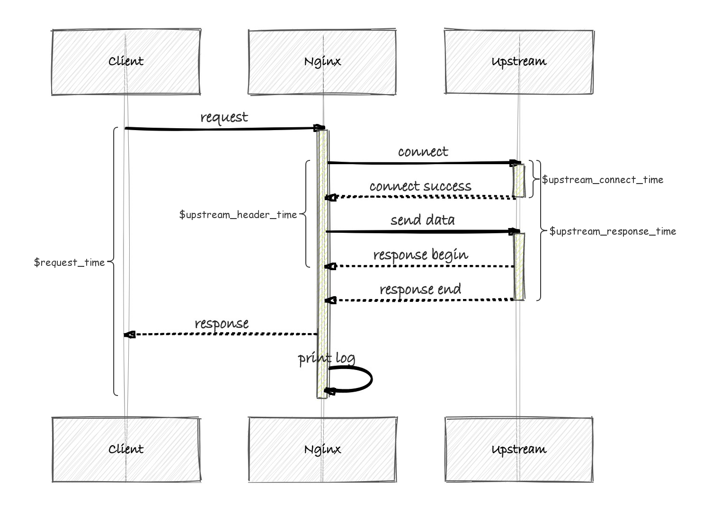

## 现象

直观感受，亿欧网经常打开页面加载慢，没有响应，隔一段时间又恢复正常。

## 前端服务器上查看监控日志

发现大量node请求超时


## 查看后端apm监控


* 监控上响应时间正常，jvm gc正常，cpu利用率不到10%，内存正常
* 监控的gc是平均值，登录上服务器通过jstat查看，ygc10s一次，正常
* 查看数据库调用，mysql和es正常，redis调用出现了高危keys命令，需要进行优化，但整体响应时间依然在正常范围

## Keys命令


## 线程池监控

程序会记录接口最大执行时间，同时提供了查询线程池相关信息的接口，状态正常

```json
"hostname": "yiou-backend-01",
"最大允许的线程数": 100,
"线程空闲时间": 10000,
"池中存在的最大线程数": 20,
"线程池是否终止": false,
"已完成任务数量": 6367554,
"初始线程数": 20,
"核心线程数": 20,
"任务总数": 6367554,
"队列里缓存的任务数量": 0,
"线程池是否关闭": false,
"执行的任务数量": 0
```


## CLB 日志异常

clb和源站走的内网

大量upstream_response_time的数值几十秒，最高值有达到甚至六十多秒，所有的接口都会出现这种情况，不单单是一个接口


### upstream_response_time



### upstream_header_time


## 带宽

带宽上线50Mbps


## 网络排查

mtr工具测试网络，发现loss比例较大


## 思考

1. 带宽基本在10Mb-40Mb，也将font机器上的带宽临时增大到80Mb，发现问题依然存在
2. 可能是腾讯云的网络问题，我们将font机器访问clb的方式，从外网改成内网，hosts文件中指定后端接口为clb的内网ip


## 切换到内网后font机器TCP连接数减少


## 切换到内网后nat外网带宽减少

(不走外网)


## BackLog

* 带宽50M升到80M（yiou-fontend）
* trace route命令,mtr命令
* nginx，upstream_response_time 异常 

* 每隔一段时间，第一次请求慢，第二次请求快，缓存过期时间太短，增大缓存过期时间
* 监控上redis出现keys高危命令（定时任务），优化成scan和修改成固定key值
* 定时任务优化，有些任务根据判断条件提前结束，有些扫描keys去掉，降低一些任务频率
* {GET}/api/field/fieldInfo/{id}，缓存失效定位到慢查询3张表关联,加上缓存


## 优化后apm监控


## 优化

* redis中存入文章详情，key大小优化，25kb到10kb以内，去掉contentHtml
* redis IYIOU_TOP_POST大小优化，734kb到62 kB
* 首页快讯列表去掉content
* 文章详情页，推荐列表和热门文章去掉content，82kb--->10kb
* 文章详情作者最新文章和作者详情页文章列表去掉content


