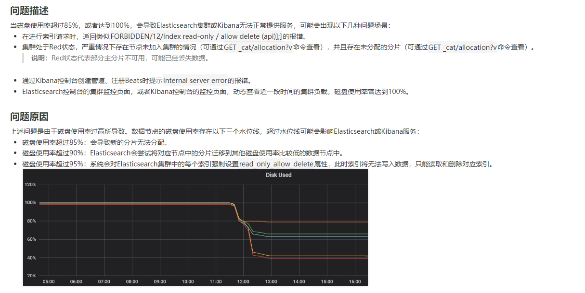

## 项目背景

亿欧数据平台将需要检索的情报数据放入到es中，数据部门负责往情报索引中写入数据，我们后台开发部编写搜索相关功能的代码，使用的是阿里云的es，后端技术部门负责平时的维护，项目上线运行一段时间后，数据部门给我们反馈es写入情报的索引失败。

## 集群es配置

3节点1 kibana，2c8g，每个节点50g内存，7.10版本

## 异常分析

登录上阿里云es实例，发现集群状态变红red，查看集群的日志，发现日志抛出FORBBIDDEN ，read-only等异常，并从集群监控中看到磁盘使用率到达警戒线，空间已经快满了，定位到问题



## kibana命令排查

* GET _cluster/health 查看集群状态red

* GET _cluster/allocation/explain 由于集群red，至少有一个主分片没分配，使用该命令查看未分配的原因是由于磁盘空间不够创建新的索引时分片分配失败

* GET _cat/allocation?v 查看每个节点的使用情况，发现其中一个节点使用率快满了，另外两个节点还有一些空间，推测应该是索引分片设置不合理导致数据分配不均衡
```java
  shards disk.indices disk.used disk.avail disk.total disk.percent        node
    36     43.2gb      46.8gb      2.7gb    49.5gb      95    es-cn-tl32mh5zu000oix2x-7f05b6b5-0001
    35     18.8gb      20.8gb      28.7gb   49.5gb      42    es-cn-tl32mh5zu000oix2x-7f05b6b5-0002
    36     39.3gb      41.9gb      7.6gb    49.5gb      85    es-cn-tl32mh5zu000oix2x-7f05b6b5-0003

```
* GET _cat/shards 通过kibana查看每个索引在节点上的具体分片，发现情报索引只有一个shard，并且占用了主要的空间

## 如何解决

1. 升级es的磁盘配置，但由于成本审批和时间问题，此方案暂时搁浅，后期对es进行了升级
2. 将情报索引重新分片，设置多个分片，不采用默认的配置。如果删除索引，重新写入，在很长一段时间内会影响用户体验，该方案是有损的。那么如何更加优雅解决？

## reindex+别名

程序使用的是情报索引的别名，可以新建索引，重新设置分片数量为3，均匀分配在3个节点，但此时有个问题，磁盘空间本来就不够，如何能够进行reindex操作？

## 设置replicas为0

思考半天，可以巧妙的将集群中索引的replicas副本数量设置为0个，先释放出足够的空间，也不影响业务，如此一来，就有足够的空间来进行reindex操作，待reindex操作完成之后，切换索引别名，将旧的情报索引删除之后，最后将replicas副本数量重新设置为1

## reindex脚本

```java

POST _reindex?slices=3&wait_for_completion=false
{
    "conflicts": "proceed",
    "source": {
        "index": "dp_intellegence",
        "size":2000
    },
    "dest": {
        "index": "dp_intellegence_new"
    }
}

//重建时禁用副本，复制完成后，启动副本
PUT /dp_intellegence_new/_settings
{
    "number_of_replicas": 0
}

//重建索引，关掉refresh间隔，重建完成后打开refresh_interval=30
PUT /dp_intellegence_new/_settings
{ 
    "refresh_interval": -1 
}

// 获取 reindex 相关任务
GET _tasks?detailed=true&actions=*reindex
GET /_tasks/jj_8bfVtQpuwztDgY7YuNQ:6910244

```

整个reindex过程速度比较快，几十个g的数据，10-20分钟完成

## 反思

1. 忘了在阿里云设置es的监控报警，没有收到告警的消息通知

2. 前期没有对集群进行容量规划，需要考虑索引的大小，每天增量数据是多少，设置多少分片合适，需要预留15%的磁盘水位空间。而且从情报的索引分片数量为1来看，字段的类型是不是也是使用的默认的配置，没有设置合理的字段类型。

## 重新数据建模

为了节约成本，充分利用好存储资源空间，对现有的索引建模进行修改，好的数据建模能够存储更多的数据，查询也更高效；

* 查看现有的情报mapping结构，发现所有字符串类型的字段采用了默认的配置，包含了keyword和text字段，去掉不需要分词的text字段
* 索引中存在不需要进行检索的字段，将这些字段存放在数据库（用的mongo）中，在es中检索到id后去数据库查询详情
* 对字段的doc_values，index，norms，index_options等属性进行修改，进一步优化空间

重新设置mapping结构以后，再次进行reindex操作

> 当时第一次优化时，主要是将dp_intelligence将content设置为（index:false---content字段不参与检索，doc_values: false--content字段不会参与聚合排序），存储少了12G，第二次优化时将content字段存储到mongo中，存储又节省了一大半

## 建模规范

为部门制定了一份es的建模规范，从逻辑建模到数据建模时进行参考

1. 存储空间估算
     原始数据存入到ES中，会有三部分数据行存（StoreFiled）、列存（DocValues）和倒排索引（InvertIndex）,
     行存主要是_source字段存放原始数据，
     列存用来支持排序、聚合功能，
     倒排索引部分用于查询。
     因此存放到es需要用到的存储空间是原来的几倍（还要考虑副本），建议容量=原始数据数据大小*3.38。

2. 控制字段的存储选项来节省空间
     行存：一般开启_source，如果关闭后，不能进行reindex操作
     列存：如果字段没有排序、聚合等需求，将该字段的属性doc_values设置为false
     倒排索引：如果字段没有查询需求，关闭index，将index设置为false
     string类型字段：如果搜索时不需要评分，关闭norms;如果搜索时不需要评分高亮等，设置index_options为doc

3. 创建索引时开启最佳压缩，进一步节省空间
      "index.codec": "best_compression"

4. 分片设置
   	如果索引数据量小，可设置为1个分片；
      	对于数据量稍大的索引，目前设置为3个。（100g以内的数据一般设置3~5个分片）
      	数据量大100g以上，单个分片控制（10g-30g）（20g-50g），分片数过多进一步拆分成多个index

5. index.max_result_window设置
   	创建索引时,默认为1w，所以经常出现"翻最后一页无数据的情况",后面创建索引时，统一更改为10w

6. 数据存储原则
   	es中只存放需要参与检索、排序、聚合等字段，将其他字段存放到其他数据库

7. 多表关联设计原则
   	宽表冗余存储>nested存储>父子文档存储，单个nested存储上限默认1w条，nested不支持范围过滤