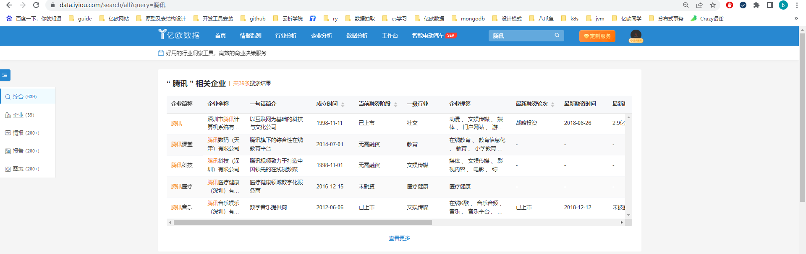
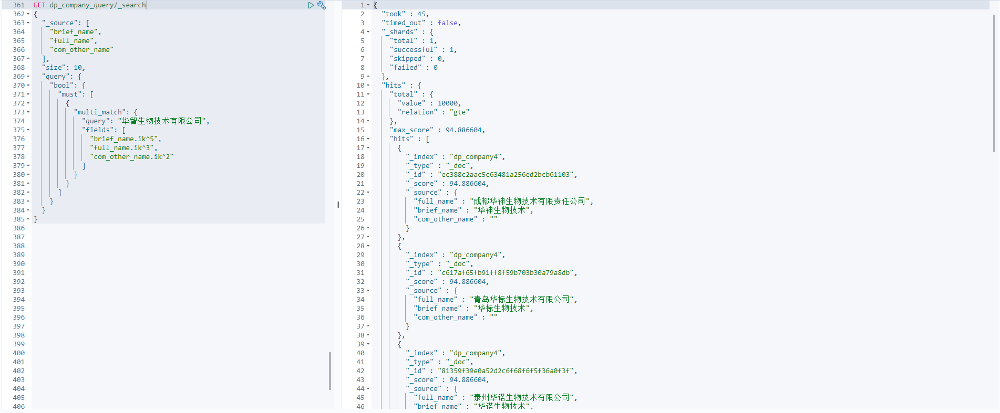
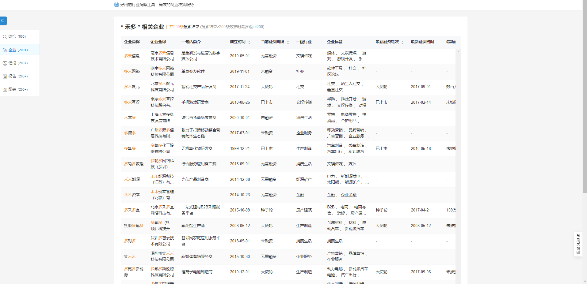
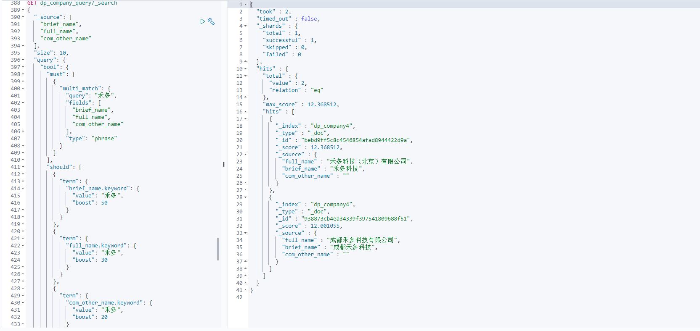

## 背景

亿欧数据全局搜索中输入企业名称，搜索相关企业，对企业的简称、全称和其他简称只要任一匹配就返回，但权重不一样，简称占50%，全称占30%，其他简称占20%

## dsl-1

brief_name，full_name，com_other_name使用的ik分词器

```java
GET dp_company_0107/_search
{
  "_source": [
    "brief_name",
    "full_name",
    "com_other_name"
  ],
  "size": 10,
  "query": {
    "bool": {
      "must": [
        {
          "multi_match": {
            "query": "腾讯",
            "fields": [
              "brief_name.ik^5",
              "full_name.ik^3",
              "com_other_name.ik^2"
            ]
          }
        }
      ]
    }
  }
}
```



## 企业搜索结果排序不准

测试时发现，搜索“华智生物技术有限公司”企业时，它的全称完全匹配，但是并没有预期展示在最前面。



因为是按照分词来进行全文检索企业，华智生物技术有限公司会分词为：华，智，生物技术，生物，技术，有限公司，有限，公司，8个term去brief_name,full_name,crm_other_name三个字段进行match，计算得分相加来排序，所以搜索华智生物技术有限公司不一定排名在前。

## dsl-2

搜索时，当简称、全称、其他名称完全匹配时，结果列表中需要展示在前面，因此我们新增should来提高评分，同样的，简称，全称，其他名称的权重也要设置

```java
GET dp_company_query/_search
{
  "_source": [
    "brief_name",
    "full_name",
    "com_other_name"
  ],
  "size": 10,
  "query": {
    "bool": {
      "must": [
        {
          "multi_match": {
            "query": "华智生物技术有限公司",
            "fields": [
              "brief_name.ik^5",
              "full_name.ik^3",
              "com_other_name.ik^2"
            ]
          }
        }
      ],
      "should": [
        {
          "term": {
            "brief_name.keyword": {
              "query": "华智生物技术有限公司",
              "boost": 50
            }
          }
        },
        {
          "term": {
            "full_name.keyword": {
              "query": "华智生物技术有限公司",
              "boost": 30
            }
          }
        },
        {
          "term": {
            "com_other_name.keyword": {
              "query": "华智生物技术有限公司",
              "boost": 20
            }
          }
        }
      ]
    }
  }
}
```


## 搜索结果体验差，不符合预期

我们想用“禾多科技”的简称（禾多）来搜索，输入“禾多”，展示的都是多禾、多、禾关键词的企业，第一页没有找到我们想要的禾多科技企业



## dsl-3

既然match召回率高但准确率不高，我们直接使用phrase短语来进行多字段匹配

```java
GET dp_company_query/_search
{
  "_source": [
    "brief_name",
    "full_name",
    "com_other_name"
  ],
  "size": 10,
  "query": {
    "bool": {
      "must": [
        {
          "multi_match": {
            "query": "禾多",
            "fields": [
              "brief_name.ik^5",
              "full_name.ik^3",
              "com_other_name.ik^2"
            ],
            "type": "phrase"
          }
        }
      ],
      "should": [
        {
          "term": {
            "brief_name.keyword": {
              "value": "禾多",
              "boost": 50
            }
          }
        },
        {
          "term": {
            "full_name.keyword": {
              "value": "禾多",
              "boost": 30
            }
          }
        },
        {
          "term": {
            "com_other_name.keyword": {
              "value": "禾多",
              "boost": 20
            }
          }
        }
      ]
    }
  }
}
```

## 搜索结果找不到企业


直接傻眼了，这种情况直接一个结果都搜索不出来，原来的match虽然不准，但是多翻页还是能找到结果。查看禾多、禾多科技分词结果：


因为短语匹配是要分词后的每个term都能匹配到，在不指定slot前提下，position位置也要相邻，所以搜索禾多时找不到匹配的企业。

## dsl-4

既然ik分词不准，我们可以更换成默认的单字分词

```java
GET dp_company_query/_search
{
  "_source": [
    "brief_name",
    "full_name",
    "com_other_name"
  ],
  "size": 10,
  "query": {
    "bool": {
      "must": [
        {
          "multi_match": {
            "query": "禾多",
            "fields": [
              "brief_name^5",
              "full_name^3",
              "com_other_name^2"
            ],
            "type": "phrase"
          }
        }
      ],
      "should": [
        {
          "term": {
            "brief_name.keyword": {
              "value": "禾多",
              "boost": 50
            }
          }
        },
        {
          "term": {
            "full_name.keyword": {
              "value": "禾多",
              "boost": 30
            }
          }
        },
        {
          "term": {
            "com_other_name.keyword": {
              "value": "禾多",
              "boost": 20
            }
          }
        }
      ]
    }
  }
}
```

