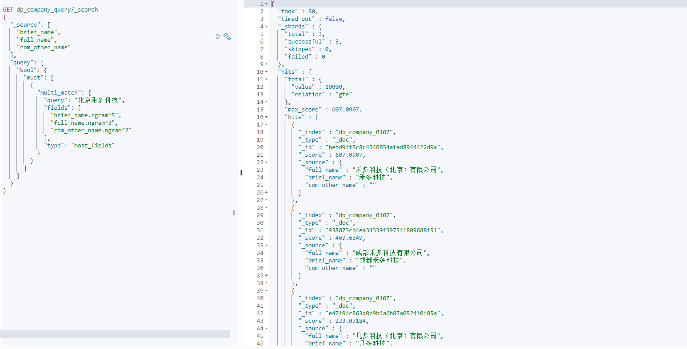

## 背景

亿欧数据全局搜索中输入企业名称，搜索相关企业，对企业的简称、全称和其他简称只要任一匹配就返回，但权重不一样，简称占50%，全称占30%，其他简称占20%

## dsl-1

brief_name，full_name，com_other_name使用的ik分词器

```java
GET dp_company_0107/_search
{
  "_source": [
    "brief_name",
    "full_name",
    "com_other_name"
  ],
  "size": 10,
  "query": {
    "bool": {
      "must": [
        {
          "multi_match": {
            "query": "腾讯",
            "fields": [
              "brief_name.ik^5",
              "full_name.ik^3",
              "com_other_name.ik^2"
            ]
          }
        }
      ]
    }
  }
}
```


## 企业搜索结果排序不准

测试时发现，搜索“华智生物技术有限公司”企业时，它的全称完全匹配，但是并没有预期展示在最前面。


因为是按照分词来进行全文检索企业，华智生物技术有限公司会分词为：华，智，生物技术，生物，技术，有限公司，有限，公司，8个term去brief_name,full_name,crm_other_name三个字段进行match，计算得分相加来排序，所以搜索华智生物技术有限公司不一定排名在前。

## dsl-2

搜索时，当简称、全称、其他名称完全匹配时，结果列表中需要展示在前面，因此我们新增should来提高评分，同样的，简称，全称，其他名称的权重也要设置

```java
GET dp_company_query/_search
{
  "_source": [
    "brief_name",
    "full_name",
    "com_other_name"
  ],
  "size": 10,
  "query": {
    "bool": {
      "must": [
        {
          "multi_match": {
            "query": "华智生物技术有限公司",
            "fields": [
              "brief_name.ik^5",
              "full_name.ik^3",
              "com_other_name.ik^2"
            ]
          }
        }
      ],
      "should": [
        {
          "term": {
            "brief_name.keyword": {
              "query": "华智生物技术有限公司",
              "boost": 50
            }
          }
        },
        {
          "term": {
            "full_name.keyword": {
              "query": "华智生物技术有限公司",
              "boost": 30
            }
          }
        },
        {
          "term": {
            "com_other_name.keyword": {
              "query": "华智生物技术有限公司",
              "boost": 20
            }
          }
        }
      ]
    }
  }
}
```


## 搜索结果体验差，不符合预期

我们想用“禾多科技”的简称（禾多）来搜索，输入“禾多”，展示的都是多禾、多、禾关键词的企业，第一页没有找到我们想要的禾多科技企业


## dsl-3

既然match召回率高但准确率不高，我们直接使用phrase短语来进行多字段匹配

```java
GET dp_company_query/_search
{
  "_source": [
    "brief_name",
    "full_name",
    "com_other_name"
  ],
  "size": 10,
  "query": {
    "bool": {
      "must": [
        {
          "multi_match": {
            "query": "禾多",
            "fields": [
              "brief_name.ik^5",
              "full_name.ik^3",
              "com_other_name.ik^2"
            ],
            "type": "phrase"
          }
        }
      ],
      "should": [
        {
          "term": {
            "brief_name.keyword": {
              "value": "禾多",
              "boost": 50
            }
          }
        },
        {
          "term": {
            "full_name.keyword": {
              "value": "禾多",
              "boost": 30
            }
          }
        },
        {
          "term": {
            "com_other_name.keyword": {
              "value": "禾多",
              "boost": 20
            }
          }
        }
      ]
    }
  }
}
```

## 搜索结果找不到企业


直接傻眼了，这种情况直接一个结果都搜索不出来，原来的match虽然不准，但是多翻页还是能找到结果。查看禾多、禾多科技分词结果：


因为短语匹配是要分词后的每个term都能匹配到，在不指定slot前提下，position位置也要相邻，所以搜索禾多时找不到匹配的企业。

## dsl-4

既然ik分词不行，我们可以尝试换成默认的单字分词

```java
GET dp_company_query/_search
{
  "_source": [
    "brief_name",
    "full_name",
    "com_other_name"
  ],
  "size": 10,
  "query": {
    "bool": {
      "must": [
        {
          "multi_match": {
            "query": "禾多",
            "fields": [
              "brief_name^5",
              "full_name^3",
              "com_other_name^2"
            ],
            "type": "phrase"
          }
        }
      ],
      "should": [
        {
          "term": {
            "brief_name.keyword": {
              "value": "禾多",
              "boost": 50
            }
          }
        },
        {
          "term": {
            "full_name.keyword": {
              "value": "禾多",
              "boost": 30
            }
          }
        },
        {
          "term": {
            "com_other_name.keyword": {
              "value": "禾多",
              "boost": 20
            }
          }
        }
      ]
    }
  }
}
```


## 企业名称部分匹配找不到

当我们搜索“北京禾多科技”时，结果中应该有禾多科技，但是由于用的是单字的短语匹配，搜索结果为空。


## 自定义分词-ngram

单字的短语匹配又太“精准”，导致结果中没有我们想要的企业，我们想要的是关键词部分匹配上就能检索出结果。

* match+ik分词搜索结果体验差，召回率高不精准

* match_phrase+ik和match_phrase+standard 太精准，召回率不高。

这时候我们可以使用ngram的分词方式+match可以达到我们想要的部分匹配效果

```java
PUT dp_company_query
{
  "settings": {
    "index.max_ngram_diff": 15,
    "number_of_replicas": 0,
    "number_of_shards": 3,
    "refresh_interval": "30s",
    "analysis": {
      "analyzer": {
        "company_analyzer": {
          "tokenizer": "company_ngram_tokenizer"
        }
      },
      "tokenizer": {
        "company_ngram_tokenizer": {
          "token_chars": [
            "letter",
            "digit"
          ],
          "min_gram": 2,
          "max_gram": 15,
          "type": "ngram"
        }
      }
    }
  },
  "mappings": {
    "properties": {
      "brief_name": {
        "type": "text",
        "fields": {
          "ik": {
            "type": "text",
            "analyzer": "ik_max_word"
          },
          "keyword": {
            "type": "keyword",
            "ignore_above": 256
          },
          "ngram": {
            "type": "text",
            "analyzer": "company_analyzer"
          }
        }
      },
      "com_other_name": {
        "type": "text",
        "fields": {
          "ik": {
            "type": "text",
            "analyzer": "ik_max_word"
          },
          "keyword": {
            "type": "keyword",
            "ignore_above": 256
          },
          "ngram": {
            "type": "text",
            "analyzer": "company_analyzer"
          }
        }
      },
      "full_name": {
        "type": "text",
        "fields": {
          "ik": {
            "type": "text",
            "analyzer": "ik_max_word"
          },
          "keyword": {
            "type": "keyword",
            "ignore_above": 256
          },
          "ngram": {
            "type": "text",
            "analyzer": "company_analyzer"
          }
        }
      }
    }
  }
}
```


## dsl-5

```java
GET dp_company_query/_search
{
  "_source": [
    "brief_name",
    "full_name",
    "com_other_name"
  ],
  "query": {
    "bool": {
      "must": [
        {
          "multi_match": {
            "query": "北京禾多科技",
            "fields": [
              "brief_name.ngram^5",
              "full_name.ngram^3",
              "com_other_name.ngram^2"
            ],
            "type": "most_fields"
          }
        }
      ]
    }
  }
}
```





## 企业市值估值因素影响相关度


通常我们搜索企业，越有名气，市值估值越高，越有可能是我们想要的结果，因此我们希望将市值估值高的放在搜索结果列表相对靠前的位置，而且全文检索的评分依旧是主要排序依据。可以使用function score+field_value_factor来自定义评分

## dsl-6

```java
GET dp_company_query/_search
{
  "from": 0,
  "size": 20,
  "query": {
    "function_score": {
      "query": {
        "bool": {
          "must": [
            {
              "multi_match": {
                "query": "阿里",
                "fields": [
                  "brief_name.ngram^5",
                  "full_name.ngram^3",
                  "com_other_name.ngram^2"
                ],
                "type": "most_fields"
              }
            }
          ]
        }
      },
      "functions": [
        {
          "filter": {
            "match_all": {
              "boost": 1
            }
          },
          "field_value_factor": {
            "field": "market_valuation_rmb",
            "factor": 1,
            "missing": 0,
            "modifier": "log2p"
          }
        }
      ],
      "score_mode": "sum",
      "boost_mode": "multiply",
      "boost": 1
    }
  },
  "_source": {
    "includes": [
      "brief_name",
      "com_other_name",
      "full_name",
      "market_valuation_rmb"
    ]
  }
}
```


## 参考

- [Elasticsearch-Function Score Query](https://www.elastic.co/guide/en/elasticsearch/reference/5.6/query-dsl-function-score-query.html#function-field-value-factor)
- [Elasticsearch权威指南-接受欢迎度提升权重](https://www.elastic.co/guide/cn/elasticsearch/guide/current/boosting-by-popularity.html)
- [铭毅天下-慎用wildcard](https://blog.csdn.net/laoyang360/article/details/115222329)
- [铭毅天下-提高搜索体验](https://blog.csdn.net/laoyang360/article/details/108819725)