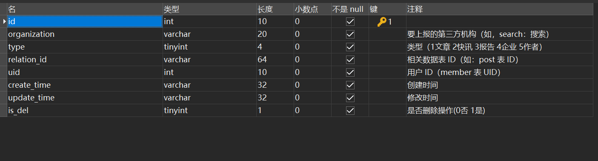

## 业务背景

  亿欧同学生产内容写入上报表，亿欧网前台展示内容，会定时同步上报表的数据到阿里云的开放搜索中，涉及全量同步和增量同步两部分，前同事开发数据同步时间较长。现需要将开放搜索功能迁移到ES中，改造代码，同时优化同步速度。

## 上报表




## 全量同步任务

批量从mysql中查询出数据，由之前的单条插入改造成批量插入到上报表中，代码略


## 增量任务优化前

### 每分钟执行一次增量同步任务

```java
@Scheduled(cron = "0 */1 * * * *") 
@RedissonLock(leaseTime = 30)//分布式锁，只允许单实例执行同步任务
public void init() throws InterruptedException {
    //同步数据到开放搜索
    initDataToOpenSearch();
}
```

### 同步数据到开放搜索代码

```java
public void initDataToOpenSearch() {
    try {
        int limit = 100;
        for (int i = 0; i < 4; i++) {
            CrmThirdPart param = new CrmThirdPart();
            param.setOrganization("search");
            param.setLimit(limit);
            List<CrmThirdPartVO> thirdList = thirdService.getThirdPartList(param);
            if (EmptyHelper.isNotEmpty(thirdList)) {
                JSONArray docsJsonArr = new JSONArray();
                for (CrmThirdPartVO third : thirdList) {
                    //此处代码省略，意图就是构造上报的数据
                    buildDoc(third,docsJsonArr);
                }
                if (EmptyHelper.isNotEmpty(docsJsonArr) && docsJsonArr.length() > 0) {
                    String docsJson = docsJsonArr.toString();
                    //上报到开放搜索
                    if (searchService.pushDataToSearch(docsJson)) {
                        for (CrmThirdPartVO thirdDel : thirdList) {
                            thirdService.delThirdPart(thirdDel.getId());
                        }
                    }
                    //省略删除缓存操作---（先更新后删除的思想）
                    sleep(1000);
                } else {
                    logger.info("---PushDataToOpenSearch task------no doc to push");
                }
            } else {
                logger.info("---PushDataToOpenSearch task------no Data to push");
            }
        }
    } catch (Exception e) {
        e.printStackTrace();
        logger.error("PushDataToOpenSearch.task" + " | msg : " + e.getMessage());
    }

}
```

### 优化前代码分析

* 每次从上报表查询100条数据，查询4次，一分钟之内任务执行完成后，剩余时间浪费
* 删除操作一条一条进行删除，没有采用批量删除，效率低下
* RedissonLock限制了只能单实例同步，线上环境多个进程没有充分利用资源

## 分页查询时采用标签记录法

记录上次分页查询的id，下次查询时从上次标记的id继续查询

[Mysql深分页问题](https://mp.weixin.qq.com/s?__biz=Mzg3NzU5NTIwNg==&mid=2247495139&idx=1&sn=9dd98a8e09af48440cc5f01d3aafd87e&chksm=cf2232caf855bbdc4ea538550ecde6c575c91a1d1b1c42f3bc6091c715dde1a4a5e90d3f7ce2&token=1627163936&lang=zh_CN&scene=21#wechat_redirect)

```sql
    select * FROM crm_third_party_submit
    where 1 = 1
      AND organization = #{organization}
      AND type = #{type}
     AND id &gt; #{id}
    ORDER BY id asc
    LIMIT #{offSet},#{limit};
```


## 增量任务优化后

### 每分钟执行一次增量同步任务

```java
  @Scheduled(cron = "0 */1 * * * *") //1分钟同步一次数据
  //@RedissonLock(leaseTime = 30) 
  public void init() throws InterruptedException {
    initDataToEs();
    //initDataToOpenSearch();
  }
```

### 同步数据到ES代码

#### bean初始化时创建同步数据线程池ThreadPoolExecutor

```java
@PostConstruct
public void initThreadPoolExecutor() {
    ThreadFactory threadFactory = new ThreadFactory() {
        private final AtomicInteger mThreadNum = new AtomicInteger(1);

        @Override
        public Thread newThread(Runnable r) {
            return new Thread(r, "third-thread-" + mThreadNum.getAndIncrement());
        }
    };
    coreThread = 10;
    //思考，如果非核心线程数设置成跟核心线程数相同数量会怎样？
    threadPoolExecutor = new ThreadPoolExecutor(coreThread,
                                                coreThread * 2, 60, TimeUnit.SECONDS,
                                                new SynchronousQueue<>(), threadFactory);
    threadPoolExecutor.prestartAllCoreThreads();
}
```

#### 使用Semaphore，CountDownLatch，AtomicInteger

* Semaphore限制并行线程数量
* CountDownLatch让主线程等待所有数据同步完成
* AtomicInteger统计已经同步的数量

```java
//上报表数据总数
Integer totalCount = thirdService.getTotalCount();
if (totalCount == 0) {
    logger.info("---PushDataToOpenSearch task------totalCount=0");
    return;
}

//计数已经同步成功的数量
AtomicInteger successCount = new AtomicInteger(0);

//每个线程一次同步的数量
int pageSize = 100;
int pages =
    totalCount % pageSize == 0 ? totalCount / pageSize : totalCount / pageSize + 1;

//限制并行线程数量
Semaphore semaphore = new Semaphore(coreThread);

//让主线程等待所有数据同步完成
CountDownLatch countDownLatch = new CountDownLatch(pages);

for (int i = 0; i < pages; i++) {
    semaphore.acquireUninterruptibly();
    threadPoolExecutor
        .execute(() -> thirdTask(successCount, pageSize, semaphore, countDownLatch));
}
countDownLatch.await();

```


#### 单个线程同步pageSize大小的数据

```java
private void thirdTask(AtomicInteger successCount, int pageSize,
                       Semaphore semaphore, CountDownLatch countDownLatch) {
    try {
   	    //利用分布式锁，去掉只能单实例同步任务的限制
        //提前分配每次需要同步数据的id区间【position,position+pageSize】
        RLock partyLock = redisson.getLock(YiouConstants.IYIOU_THIRD_PARTY_LOCK);
        boolean flag = partyLock.tryLock(30, 60, TimeUnit.SECONDS);
        if (!flag) {
            return;
        }
        Integer position = (Integer) redisUtil.get(YiouConstants.IYIOU_THIRD_PARTY_POSITION);
        CrmThirdPart param = new CrmThirdPart();
        param.setOrganization("search");
        param.setLimit(pageSize);
        if (position != null) {
            param.setId(Long.parseLong(String.valueOf(position)));
        }
        param.setOffSet(0);
        List<CrmThirdPartVO> thirdList = thirdService.getThirdPartList(param);
        if (thirdList.isEmpty()) {
            partyLock.unlock();
            return;
        }
        position = Math.toIntExact(thirdList.get(thirdList.size() - 1).getId());
        redisUtil.set(YiouConstants.IYIOU_THIRD_PARTY_POSITION, position, 5L, TimeUnit.MINUTES);
        partyLock.unlock();
        
        
        if (EmptyHelper.isNotEmpty(thirdList)) {
            BulkRequest request = new BulkRequest();
            for (CrmThirdPartVO third : thirdList) {
                //构造同步到ES的数据
                handleContent(request, third);
            }
            BulkResponse bulkResponse = restClient.bulk(request, RequestOptions.DEFAULT);
            if (!bulkResponse.hasFailures()) {
                List<Long> ids = thirdList.stream().map(CrmThirdPartVO::getId)
                    .collect(Collectors.toList());
                successCount.addAndGet(ids.size());
                //批量删除同步成功的数据
                thirdService.deleteBatch(ids);
            } else {
                for (BulkItemResponse bulkItemResponse : bulkResponse) {
                    if (bulkItemResponse.isFailed()) {
                        BulkItemResponse.Failure failure =
                            bulkItemResponse.getFailure();
                        log.error(failure.getMessage());
                    }
                }
            }
        } else {
            logger.info("---PushDataToOpenSearch task------no Data to push");
        }
    } catch (Exception e) {
        log.error(e.toString());
    } finally {
        semaphore.release();
        countDownLatch.countDown();
    }
}
```

### 优化后分析

1. 单个实例启动时，先统计出数据总数，按照每个任务同步pageSize大小的数据，计算出总共有pages个任务，因此CountDownLatch设置为pages个任务
2. 线程池核心线程数为10，并使用SynchronousQueue队列对每个任务提交都有对应的线程去处理，且仅有10个线程，因此Semaphore设置为coreThread数量，可以根据实际情况调整，当一个线程执行完分配的任务后释放信号量重新获取任务
3. 每个任务同步pageSize大小的数据，要保证每个任务查询到的数据不重复，可按照id区间进行划分，[position,position+pageSize]
4. 多个实例启动时，都会去修改上一次分配结束的position，因此需要加分布式锁，如果是单实例只需要加jvm中的锁。
5. 多个实例启动，其实每个实例同步的任务数量是小于pages的，这个时候程序正常执行countDownLatch减一，结束主线程等待。

## 异常RejectedExecutionException

```java
//当非核心线程数设置成跟核心线程数相同数量设置成一样时，抛出RejectedExecutionException，why？
threadPoolExecutor = new ThreadPoolExecutor(coreThread,coreThread, 60, 
                                            TimeUnit.SECONDS,new SynchronousQueue<>(),threadFactory);
```

### 线程池execute方法

```java
public void execute(Runnable command) {
    if (command == null)
        throw new NullPointerException();
    int c = ctl.get();
    if (workerCountOf(c) < corePoolSize) {
        if (addWorker(command, true))
            return;
        c = ctl.get();
    }
    if (isRunning(c) && workQueue.offer(command)) {
        int recheck = ctl.get();
        if (! isRunning(recheck) && remove(command))
            reject(command);
        else if (workerCountOf(recheck) == 0)
            addWorker(null, false);
    }
    //抛出异常
    else if (!addWorker(command, false))
        reject(command);
}
```

### 线程池单个worker线程执行逻辑

```java
final void runWorker(Worker w) {
    Thread wt = Thread.currentThread();
    Runnable task = w.firstTask;
    w.firstTask = null;
    w.unlock(); // allow interrupts
    boolean completedAbruptly = true;
    try {
        //任务执行完成，重新从队列中获取 workQueue.take()
        while (task != null || (task = getTask()) != null) {
            w.lock();
            if ((runStateAtLeast(ctl.get(), STOP) ||
                 (Thread.interrupted() &&
                  runStateAtLeast(ctl.get(), STOP))) &&
                !wt.isInterrupted())
                wt.interrupt();
            try {
                beforeExecute(wt, task);
                Throwable thrown = null;
                try {
                    //此处执行实际的任务，也就是thirdTask
                    task.run();
                } catch (RuntimeException x) {
                    thrown = x; throw x;
                } catch (Error x) {
                    thrown = x; throw x;
                } catch (Throwable x) {
                    thrown = x; throw new Error(x);
                } finally {
                    afterExecute(task, thrown);
                }
            } finally {
                task = null;
                w.completedTasks++;
                w.unlock();
            }
        }
        completedAbruptly = false;
    } finally {
        processWorkerExit(w, completedAbruptly);
    }
}
```

### 异常分析

单个worker执行任务task.run()，调用的是thirdTask方法，当方法执行完后会semaphore.release()释放信号量的锁资源，此时主线程被唤醒获取锁资源成功，继续往线程池添加任务，但此时这个worker并没有执行到task=getTask()方法，因此execute方法在 workQueue.offer(command)入队失败，因为使用的是SynchronousQueue，SynchronousQueue的每一次入队操作必须等待其他线程来出队，所以execute方法抛出异常。

### 异常解决

```java
//1.更改非核心线程数量
threadPoolExecutor = new ThreadPoolExecutor(coreThread,coreThread*2, 60, 
                                            TimeUnit.SECONDS,new SynchronousQueue<>(),threadFactory);
//极端情况下，所有核心线程都释放semaphore资源，进行workQueue.offer入队操作失败，还需要创建coreThread数量的非核心线程

//2.更改RejectedExecutionHandler为CallerRunsPolicy
```


