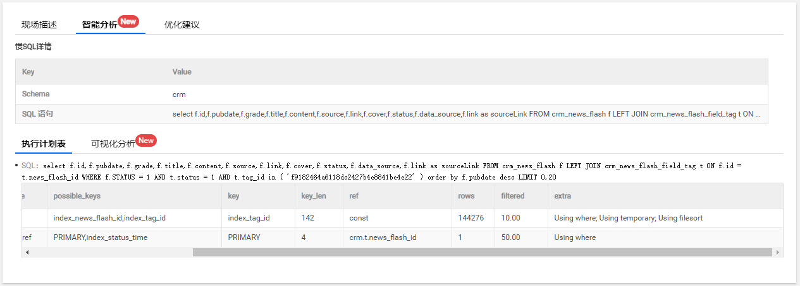
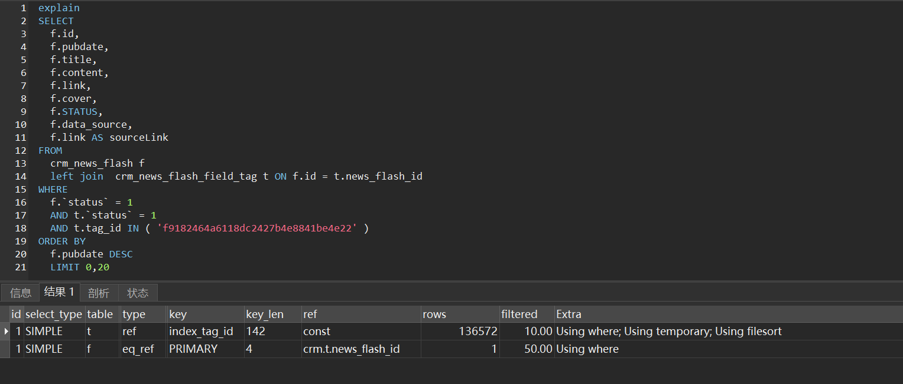
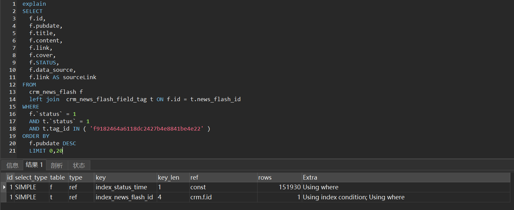
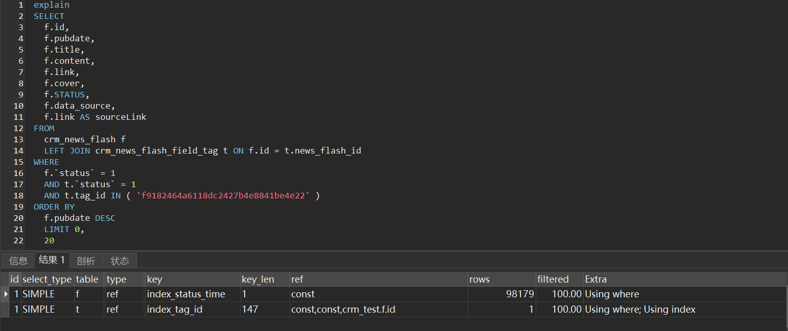

## 背景

近期线上环境从阿里云迁移到腾讯云，对mysql的版本进行了升级，从5.6升级到了5.7，腾讯云mysql监控平台有慢查询日志报警。

## 慢查询



## sql语句

```sql
SELECT
	f.id,
	f.pubdate,
	f.title,
	f.content,
	f.link,
	f.cover,
	f.STATUS,
	f.data_source,
	f.link AS sourceLink 
FROM
	crm_news_flash f
	LEFT JOIN crm_news_flash_field_tag t ON f.id = t.news_flash_id 
WHERE
	f.`status` = 1 
	AND t.`status` = 1 
	AND t.tag_id IN ( 'f9182464a6118dc2427b4e8841be4e22' ) 
ORDER BY
	f.pubdate DESC 
	LIMIT 0,20
```

crm_news_flash_field_tag表在tag_id列建有索引

crm_news_flash表主键为id，pubdate字段上有索引

## 5.7执行计划



通过执行计划分析sql执行过程：

1. join过程：

选择crm_news_flash_field_tag作为驱动表，利用index_tag_id索引进行数据筛选出news_flash_id（内部有BKA优化），选择crm_news_flash作为被驱动表，可以用上主键索引进行join筛选，查询到所需要的字段

2. order by过程：

将join后的字段存入temporary临时表，从临时表取出需要排序的字段pubdate，放入sort buffer进行排序，排序后回表（临时表）拿需要的字段，返回给客户端。

整个过程需要先将所有满足条件的记录筛选出来存入到临时表，还要进行filesort排序，耗时长。

## 5.6执行计划



通过执行计划分析sql执行过程：

选择crm_news_flash作为驱动表，利用index_status_time索引(pubdate字段)的有序性，不需要进行filesort排序，通过index_status_time索引拿到主键id，crm_news_flash_field_tag作为被驱动表，被驱动表关联的字段news_flash_id上有索引，从被驱动表取出满足条件的行返回。重复整个步骤，直到满足limit条件后结束。

## 驱动表选错分析

从crm_news_flash驱动表拿到id，到被驱动表crm_news_flash_field_tag中取出满足条件的行时，需要回表拿到status和tag_id字段来进行过滤，优化器进行成本计算时可能认为回表的成本太高，因此没有选择crm_news_flash作为驱动表

## 优化方案1

改写sql，利用STRAIGHT_JOIN，让mysql优化器固定选择crm_news_flash表作为驱动表进行查询

```sql
SELECT
	f.id,
	f.pubdate,
	f.title,
	f.content,
	f.link,
	f.cover,
	f.STATUS,
	f.data_source,
	f.link AS sourceLink 
FROM
	crm_news_flash f 
	STRAIGHT_JOIN crm_news_flash_field_tag t ON f.id = t.news_flash_id 
WHERE
	f.`status` = 1 
	AND t.`status` = 1 
	AND t.tag_id IN ( 'f9182464a6118dc2427b4e8841be4e22' ) 
ORDER BY
	f.pubdate DESC 
	LIMIT 0,
	20
```

## 优化方案2

crm_news_flash_field_tag 添加索引index_tag_id(`tag_id`, `status`, `news_flash_id`)，被驱动表上能够利用索引进行条件筛选，让优化器选择crm_news_flash表作为驱动表进行查询

