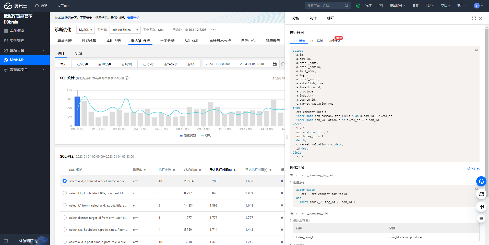
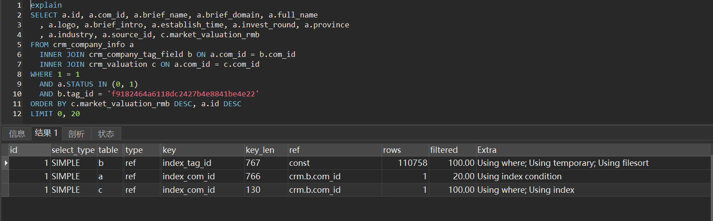
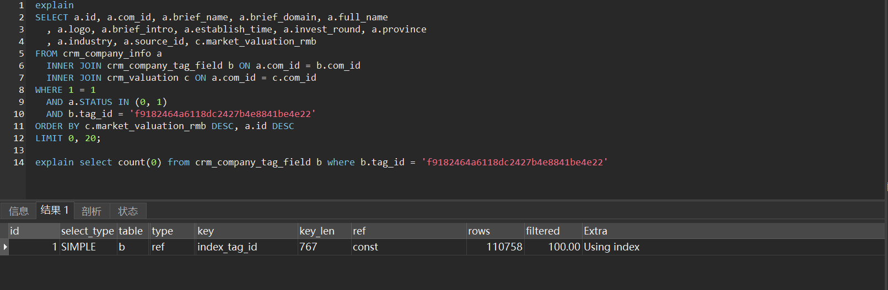
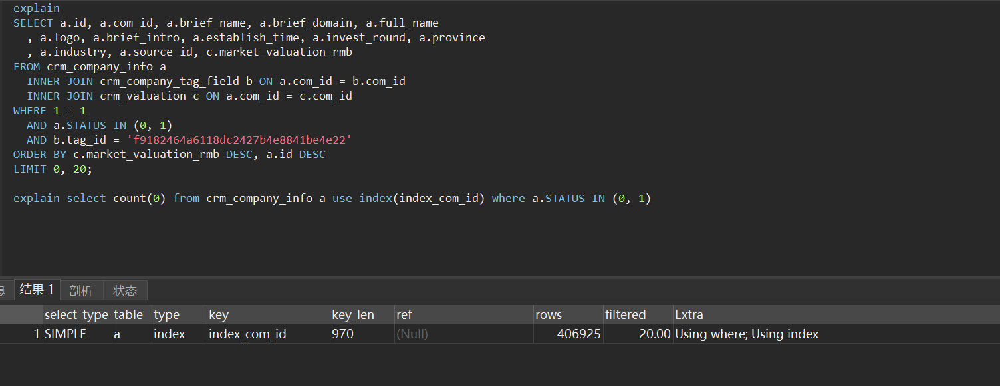
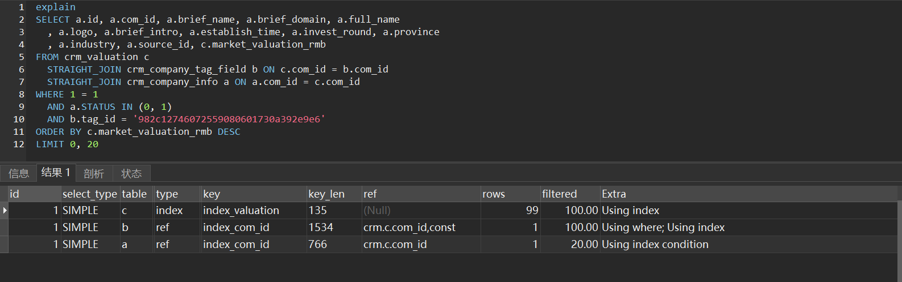
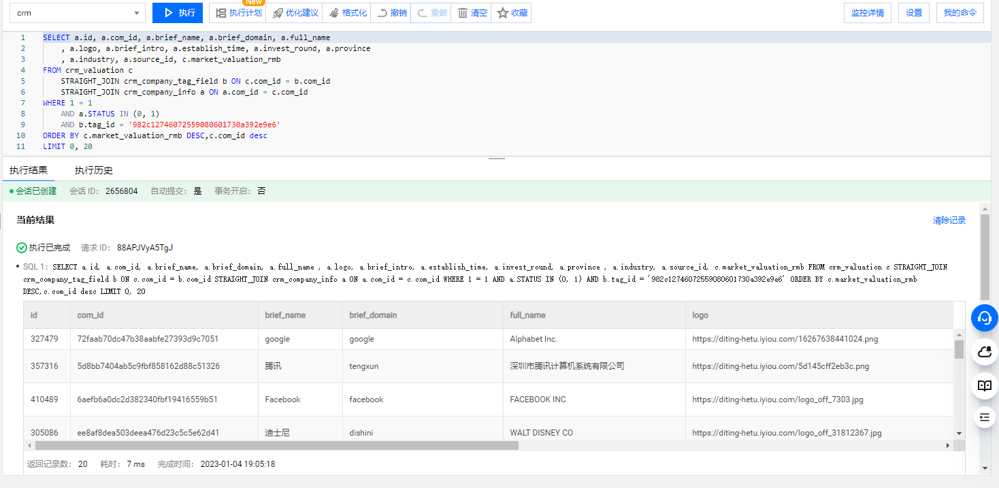
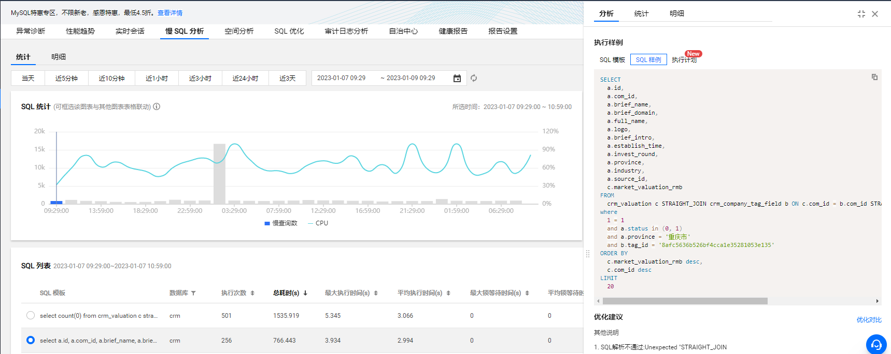
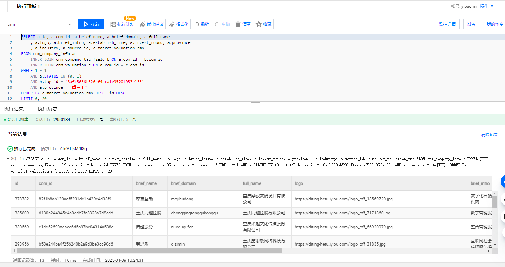
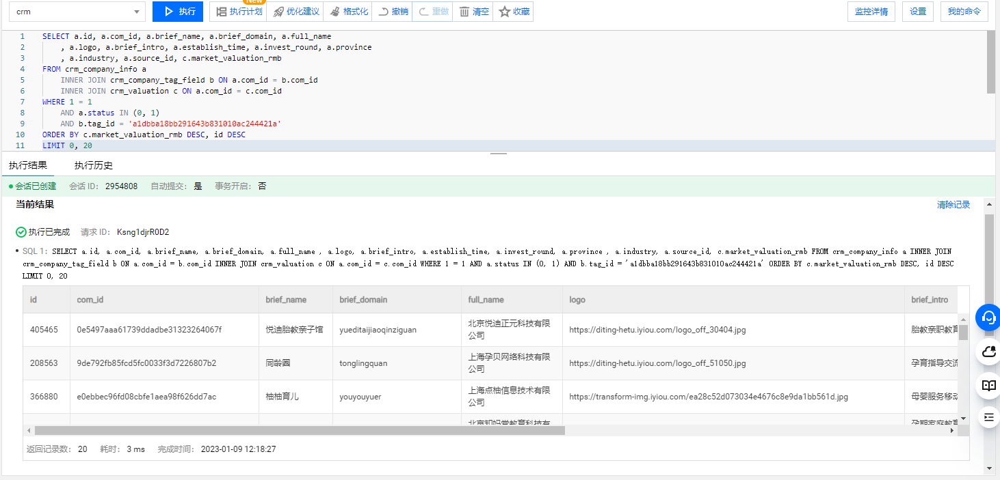
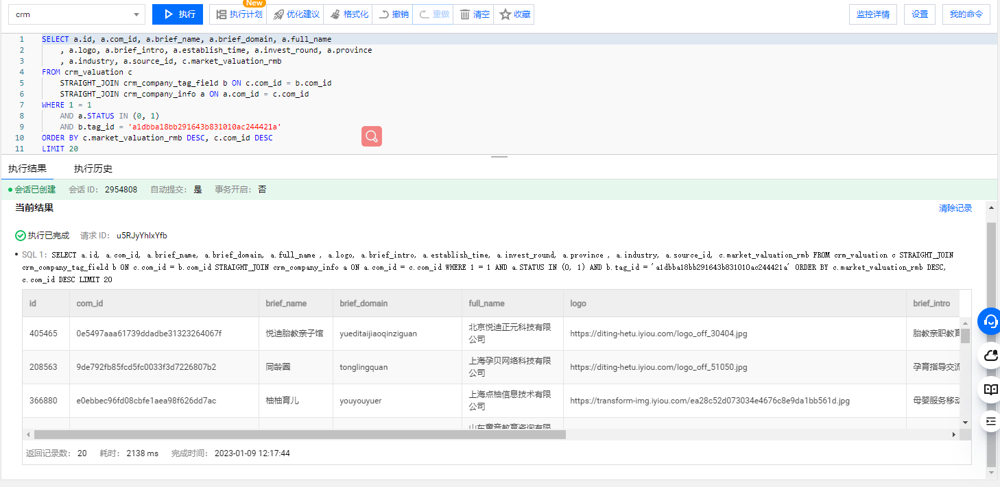

## 背景

近期在优化亿欧网的慢sql，从腾讯云DBbrain产品慢sql分析中执行次数/最大执行时间耗时最长的开始优化。



## sql语句

```sql
SELECT a.id, a.com_id, a.brief_name, a.brief_domain, a.full_name
	, a.logo, a.brief_intro, a.establish_time, a.invest_round, a.province
	, a.industry, a.source_id, c.market_valuation_rmb
FROM crm_company_info a
	INNER JOIN crm_company_tag_field b ON a.com_id = b.com_id
	INNER JOIN crm_valuation c ON a.com_id = c.com_id
WHERE 1 = 1
	AND a.status IN (0, 1)
	AND b.tag_id = 'f9182464a6118dc2427b4e8841be4e22'
ORDER BY c.market_valuation_rmb DESC, id DESC
LIMIT 0, 20
```

crm_company_info 企业信息表

crm_company_tag_field 企业关联的行业表

crm_valuation 企业市值估值表

该条sql查询出 tag_id= 'f9182464a6118dc2427b4e8841be4e22' 行业下，市值估值前20的企业


## 优化前执行计划




crm_company_tag_field 扫描行数




crm_company_info 扫描行数



执行计划分析：

mysql指定了连接条件，满足条件记录行数少的作为驱动表，选择crm_compay_tag_field作为驱动表，用上index_tag_id 对行业进行过滤，然后去被驱动表crm_company_info查询出详情，并根据status进行过滤，最后关联上crm_valuation表拿到market_valuation_rmb数据，循环上面步骤，将数据放入临时表，再从临时表拿出数据按照market_valuation_rmb进行排序，整个过程需要扫描所有tag_id=‘f9182464a6118dc2427b4e8841be4e22’的数据关联上企业数据，并创建临时表和文件排序，耗时长。


## 优化后sql

```sql
SELECT a.id, a.com_id, a.brief_name, a.brief_domain, a.full_name
	, a.logo, a.brief_intro, a.establish_time, a.invest_round, a.province
	, a.industry, a.source_id, c.market_valuation_rmb
FROM crm_valuation c
	STRAIGHT_JOIN crm_company_tag_field b ON c.com_id = b.com_id
	STRAIGHT_JOIN crm_company_info a ON a.com_id = c.com_id
WHERE 1 = 1
	AND a.STATUS IN (0, 1)
	AND b.tag_id = '982c12746072559080601730a392e9e6'
ORDER BY c.market_valuation_rmb DESC
LIMIT 0, 20
```

## 优化后执行计划



利用straight_join改写sql，选择crm_valuation作为驱动表，利用索引有序性，去掉临时表的创建和文件排序，同时扫描行数减少，只需要扫描到满足20条记录就可以返回结果给客户端

## 优化后耗时




## mybatis中的动态sql

```sql
SELECT
    a.id,
    a.com_id,
    a.brief_name,
    a.brief_domain,
    a.full_name,
    a.logo,
    a.brief_intro,
    a.establish_time,
    a.invest_round,
    a.province,
    a.industry,
    a.source_id,
    c.market_valuation_rmb
    FROM
    crm_company_info a
    <if test=' tagId != null and tagId !="" '>
      INNER JOIN crm_company_tag_field b ON a.com_id = b.com_id
    </if>
    INNER JOIN crm_valuation c ON a.com_id = c.com_id
    where 1 = 1
    and a.status in (0,1)
    <if test=' province != null and province !="" '>
      and a.province = #{province}
    </if>
    <if test="rounds !=null ">
      and a.invest_round = #{rounds}
    </if>
    <if test=' tagId != null and tagId !="" '>
      and b.tag_id = #{tagId}
    </if>
    <choose>
      <when test=' sortKey!=null and sortKey =="valuation" '>
        ORDER BY c.market_valuation_rmb ${sortType}
      </when>
      <when test=' sortKey!=null and sortKey =="investRound" '>
        ORDER BY a.invest_round ${sortType}
      </when>
      <otherwise>
        ORDER BY a.establish_time ${sortType}
      </otherwise>
    </choose>
    ,id desc
    <if test="offSet != null">
      limit #{offSet},#{limit}
    </if>
```

需要去项目中改写sql时，发现不太好直接改写，orm框架用的mybatis，编写sql语句时使用了动态sql，当order by字段不同时，sql的执行计划也不同，改写成straight join 时就固定了驱动表，所以此处需要在程序代码中先进行判断，根据条件不同，执行不同的sql，不能用一个动态sql包含所有情况。以后在编写mybatis的动态sql时也需要考虑不同情况下sql的执行顺序，是否能用上索引，如果不确定，最好还是在程序中判断，多写一份sql，减少后期优化时工作量。

## 优化后的sql没有原来sql执行快



分析：跟之前的sql不同的是，新增了a.province='重庆市'的查询条件，之前的sql没有这个筛选条件。从之前的执行计划我们可以看出，crm_valuation走的是全索引扫描，先去crm_company_tag_field进行第一次匹配后，再到crm_company_info进行status in(0,1)匹配，crm_company_info中的数据status大部分是status为0和1的，所以能很快匹配到后返回，但是由于动态sql新增a.province条件后，匹配的企业变少了，又循环去全索引扫描crm_valuation直到找到20条符合条件的企业。

而我们使用原来的sql来执行时，耗时反而会很少

```sql
SELECT a.id, a.com_id, a.brief_name, a.brief_domain, a.full_name
	, a.logo, a.brief_intro, a.establish_time, a.invest_round, a.province
	, a.industry, a.source_id, c.market_valuation_rmb
FROM crm_company_info a
	INNER JOIN crm_company_tag_field b ON a.com_id = b.com_id
	INNER JOIN crm_valuation c ON a.com_id = c.com_id
WHERE 1 = 1
	AND a.STATUS IN (0, 1)
	AND b.tag_id = '8afc5636b526bf4cca1e35281053e135'
	AND a.province = '重庆市'
ORDER BY c.market_valuation_rmb DESC, id DESC
LIMIT 0, 20
```



虽然原来的sql逻辑没能利用上索引排序，还会创建临时表，但是在去被驱动表crm_company_info查询时，因为新增了a.province='重庆市'的查询条件，会过滤掉大部分企业，所以之后放入临时表的数据会大大减少，一个城市的企业根据行业tag过滤后，多则几千家，少则几家企业，排序也会在sort buffer中完成，耗时短。

这一类sql从mybatis的动态sql分离出来，使用原有的sql逻辑，由此可见进一步验证了，动态sql我们平常编写时需要考虑不同情况下sql的执行情况。


## 全索引index扫描sql执行时间不稳定

优化前的sql执行耗时：



优化后全索引扫描sql执行耗时：



分析：

1. 全索引扫描crm_valuation时，如果关联筛选条件tag_id的企业，它的估值很少，在crm_valuation的索引排序在后面，会将前面估值大的企业全部扫描出来，但都不满足条件，耗时长。
2. 全索引扫描crm_valuation时，分页limit越大，需要扫描的数据越多，耗时越长。

这时全索引扫描反而不如优化前的临时表+文件排序性能

