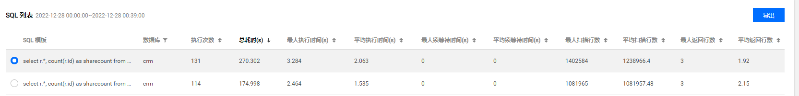
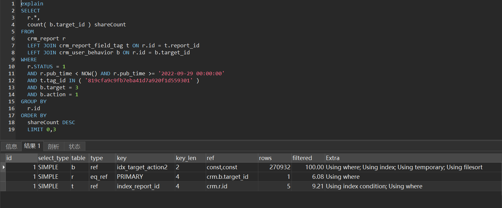
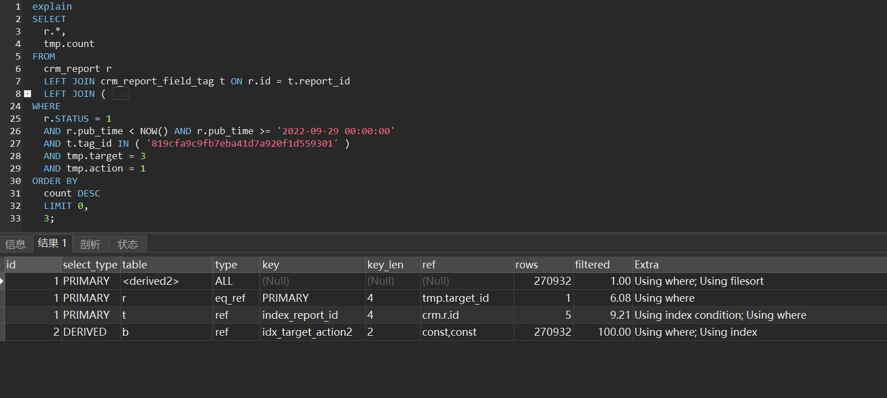
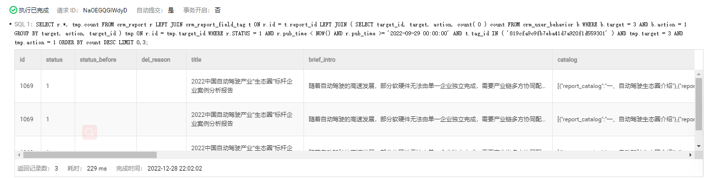

## 背景

从腾讯云mysql智能管家平台慢sql分析中，发现慢sql，默认超过1s为慢查询，该sql耗时2~3秒




## 优化前 sql

```sql
SELECT
	r.*,
	count( b.target_id ) shareCount 
FROM
	crm_report r
	LEFT JOIN crm_report_field_tag t ON r.id = t.report_id
	LEFT JOIN crm_user_behavior b ON r.id = b.target_id 
WHERE
	r.STATUS = 1 
	AND r.pub_time < NOW() AND r.pub_time >= '2022-09-29 00:00:00' 
	AND t.tag_id IN ( '819cfa9c9fb7eba41d7a920f1d559301' ) 
	AND b.target = 3 
	AND b.action = 1 
GROUP BY
	r.id 
ORDER BY
	shareCount DESC 
	LIMIT 0,3
```

crm_report：报告表

crm_report_field_tag：报告关联的标签表

crm_user_behavior：用户行为表，记录用户在网页上对内容的一些操作，action 行为类型（1下载；2购买；3在线预览；4点击），target 行为对象类型（1文章；2快讯；3报告；4广告），target_id 行为对象id

该条sql需要查询出下载量前三的报告

## 优化前执行计划



执行计划分析：

crm_user_behavior作为驱动表筛选出target=3，action=1的target_id，去被驱动表crm_report中查询符合条件的记录，再关联上crm_report_field_tag标签，再创建临时表，按照报告id进行group by分组，最后按照数量进行order by排序。

整体来看，是先join好数据后再进行分组group by统计，group by时需要创建临时表，比较耗时，所以思考能否让group by利用上索引

## 优化后sql

```sql
SELECT
	r.*,
	tmp.count 
FROM
	crm_report r
	LEFT JOIN crm_report_field_tag t ON r.id = t.report_id
	LEFT JOIN (
	SELECT
		target_id,
		target,
		action,
		count(0) count 
	FROM
		crm_user_behavior b 
	WHERE
		b.target = 3 
		AND b.action = 1 
	GROUP BY
		target,
		action，
         target_id
	) tmp ON r.id = tmp.target_id 
WHERE
	r.STATUS = 1 
	AND r.pub_time < NOW() AND r.pub_time >= '2022-09-29 00:00:00' 
	AND t.tag_id IN ( '819cfa9c9fb7eba41d7a920f1d559301' ) 
	AND tmp.target = 3 
	AND tmp.action = 1 
ORDER BY
	count DESC 
	LIMIT 0,
	3;
```

## 优化后执行计划



执行计划分析：

先在子查询中利用索引（`target`, `action`, `target_id`）来进行group by操作，统计出所有报告的下载数量，生成Derived派生表，然后派生表作为驱动表，扫描派生表去关联crm_report，查询符合条件的记录，再关联上crm_report_field_tag标签，最后按照count来进行filesort排序。

优化后执行耗时200~300ms

