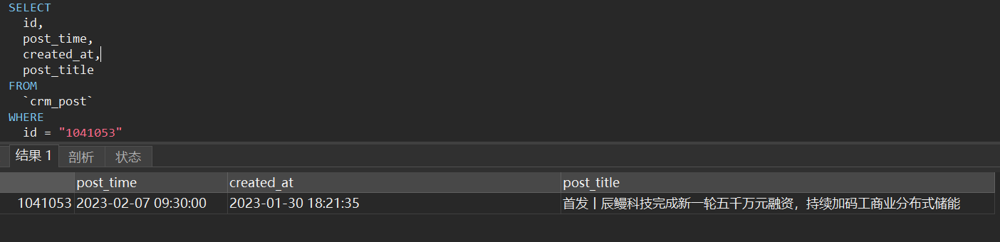
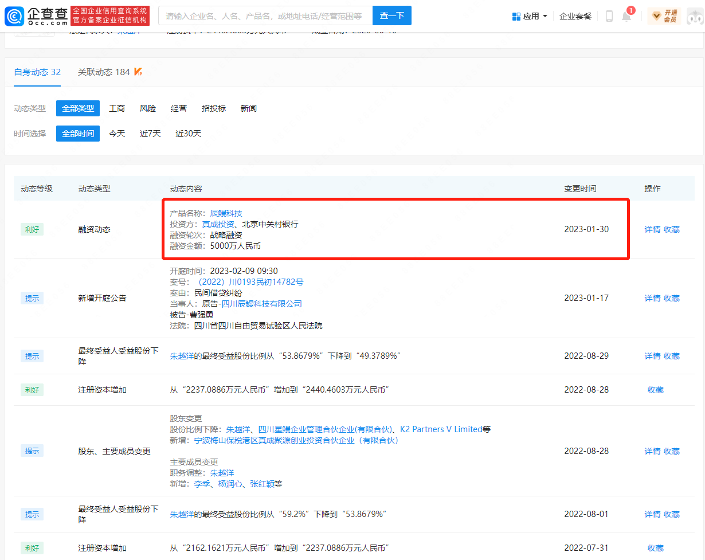
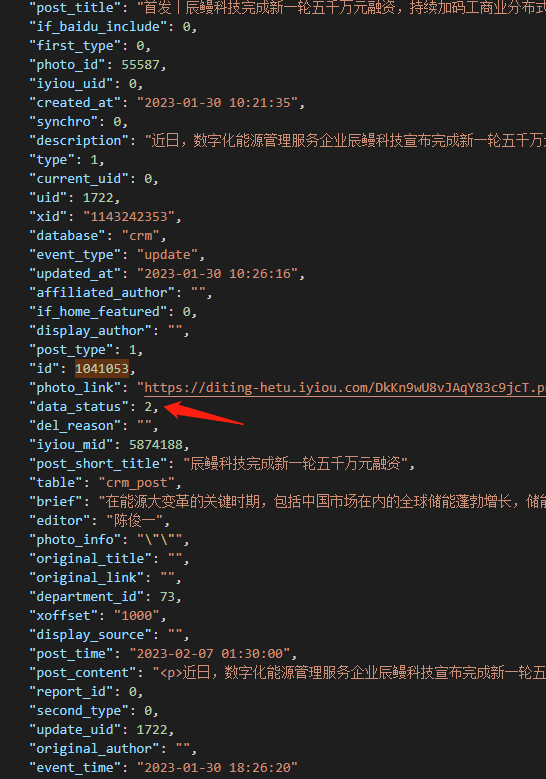
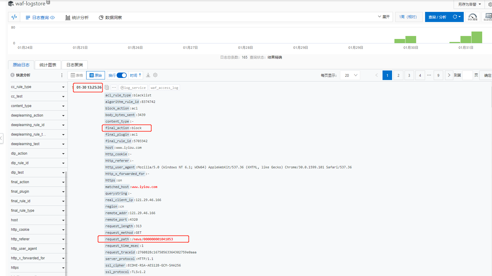
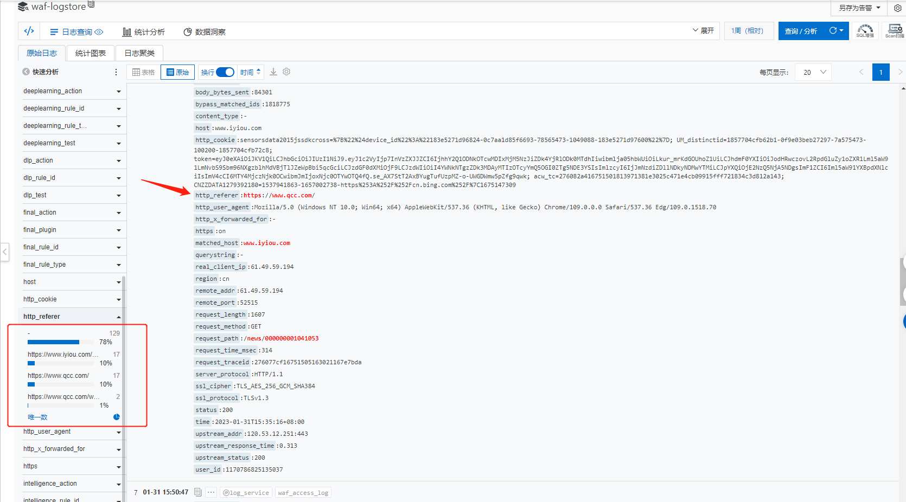
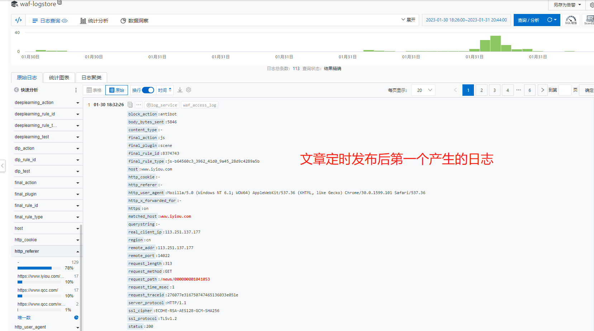
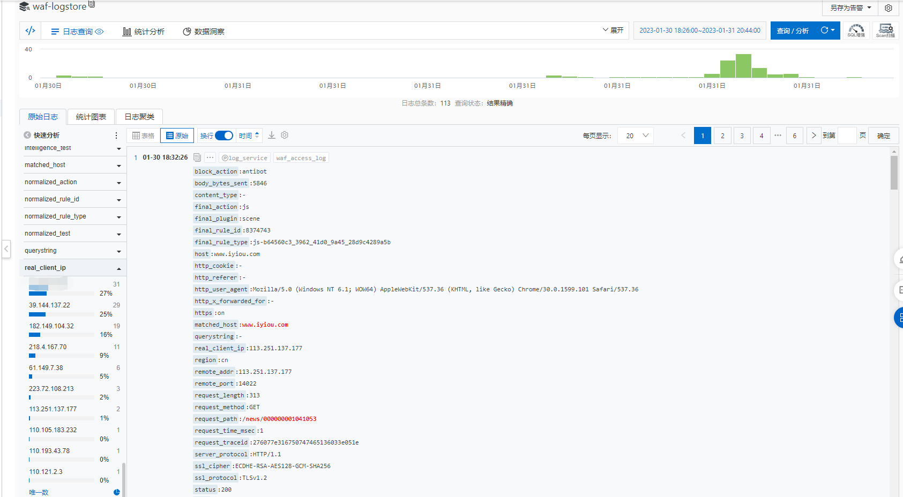

## 背景

与其他公司合作拿到敏感信息，但是信息不能提前公开，分析师会在后台编写定时发布的文章，到时间后再发布出来。但现在文章信息在“企查查”上提前暴露出来，别人公司找上门来了...

## 紧急措施

在亿欧后台下架（变更状态后会清除亿欧网对应的文章缓存信息）这篇文章，从企查查进行链接跳转，到亿欧网时查询不到数据，降低扩散范围。


## 数据库中定时文章

2023-01-30 18:21:35创建，定时为2023-02-07 09:30:00，



## 企查查爬取到信息

从变更日期2023-01-30，企查查在创建当天就爬取到文章




## 排查

### 先发布后改为定时发布？

需要判断是否是分析师误操作将文章发布出去后，被爬虫到其他网站上，然后分析师再将文章状态更改为定时发布。

由于我们亿欧后台并没有记录操作日志，数据库表中找不到变更记录，此时从哪儿查找操作记录成为一个难题？

腾讯云mysql我们没有开启审计日志也查不到，从binlog日志备份中去查也不现实。

### binlog会写入到kafka

想了一会儿，发现之前有maxwell同步工具会将文章、快讯、报告等一些表的binlog日志发送到kafka中，kafka中应该有保存最近几天的log，因此我们可以从kakfa中选取时间来进行消费查找到这篇文章的binlog变更记录

### 从kafka特定时间开始消费

1.指定group的offset到某个时间点

```shell
./kafka-consumer-groups.sh --reset-offsets --to-datetime 2023-01-30T10:00:35.000 --group third_test --bootstrap-server 10.10.192.6:9092 --execute --topic IYIOU_THIRED_SUBMIT
```

注意时间是2023-01-30T10:00:35.000，而不是文章创建时间2023-01-30 18:21:35，此处时间需要转为东八区北京时间，减去8小时

2.通过group消费，写入到文件中

```java
./kafka-console-consumer.sh -topic IYIOU_THIRED_SUBMIT --bootstrap-server 10.10.192.6:9092 --group third_test > third.json
```

3.shell工具用的Tabby Terminal,通过sz third.json命令下载到本机电脑

### 分析binlog消息

文章的状态为data_status字段，0草稿，-1删除，1已发布，2定时发布，如果是分析师进行发布操作，会在binlog日志中看到data_status=1的数据，但我们找到了data_status为0，2，-1，等于-1的日志是我们不久前下架删除了文章所产生的binlog，并没有找到等于1的日志，也就是说分析师并没有误操作发布文章。



### 定时文章为什么能显示

文章链接的url规则被推测出来，发布时间+id，202302071041053，亿欧网查询时，根据规则截取掉日期格式前缀substring(8)=1041053，拿到id后去数据库中查询。如果是已经删除/下架的文章则不会返回数据，已发布/定时发布的文章正常返回。此处询问产品，为什么将定时发布的文章也能够在前台通过路由访问到，给出原因时当时后台没有预览的功能，分析师想要在前台进行预览，后续没有更改。

### 企查查是怎么爬取到文章？

既然知道了url规则，前8位，其实是可以填写任意字符串信息的，我们的代码中也没有对前八位的日期进行校验（为什么？文章url会被百度、google等搜索引擎收录，如果文章修改后重新发布，发布时间就会变化，此时校验前八位的发布时间，那么之前被收录的url就不能访问）

因此，前8位任意字符，从小到大遍历id，比如填写########0000001到########1041053，就能爬取到文章

### WAF防火墙找到爬虫日志

亿欧网接入的是阿里云的防火墙，从防火墙的日志服务中，我们应该能找到这篇文章的访问日志，由于时定时发布的文章，在亿欧网前台网站中并不会显示，日志中显示的基本都是爬虫产生的日志。我们也确实从waf中找到了爬虫的日志 https://www.iyiou.com/news/000000001041053
以及从企查查跳转过来的日志记录。

### 文章创建前不存在1041053

这些爬虫被block




### 从企查查页面跳转过来的日志




### 文章发布后产生的日志

从binlog日志记录中找到data_status=2的这条记录的发布时间2023-01-30 10:26:16




### 非法爬取文章的ip统计

访问/news/000000001041053这种不正常路由的都是来爬虫的ip，需要将其封禁。（第一个打马的是公司ip，排查问题时访问较多）




## 解决方案

将亿欧网读取逻辑进行更改，根据id查询时，限制data_status=1，定时发布的文章以后不能在前台进行预览，只能通过亿欧后台查看。

## 拓展思考-如何防止类似问题发生

1. 根据url查询时，同时也校验解析出来的日期，但是发布时间会进行变化，因此不能采用发布时间作为url组成，可以采用创建时间
2. 不使用数据库自增id，使用有序的UUID，如自定义id(时间戳+随机数+机器码)，snowflake，百度UidGenerator等，注意时钟回拨问题


## 百度UidGenerator如何解决时钟回拨问题

1. DefaultUidGenerator 直接抛出异常
2. CachedUidGenerator，通过workerId自增、AtomicLong时间递增不依赖服务器时间，提前id到分配到RingBuffer中，这种方式生成的id时间戳可能是很早以前的

## 参考

* [百度UidGenerator 源码解析](https://developer.aliyun.com/article/894520)