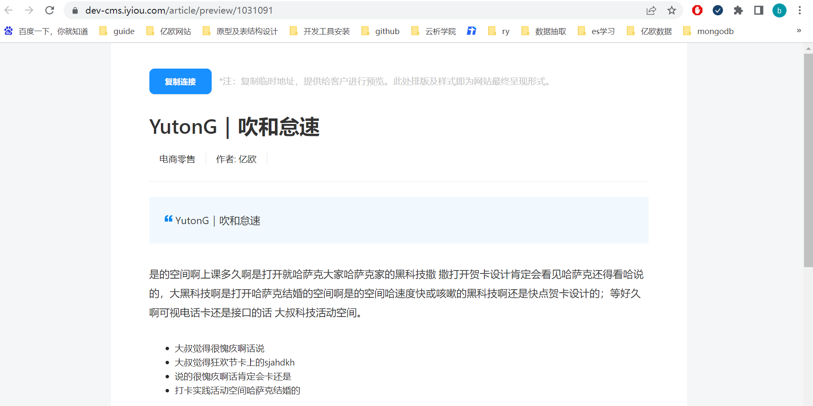
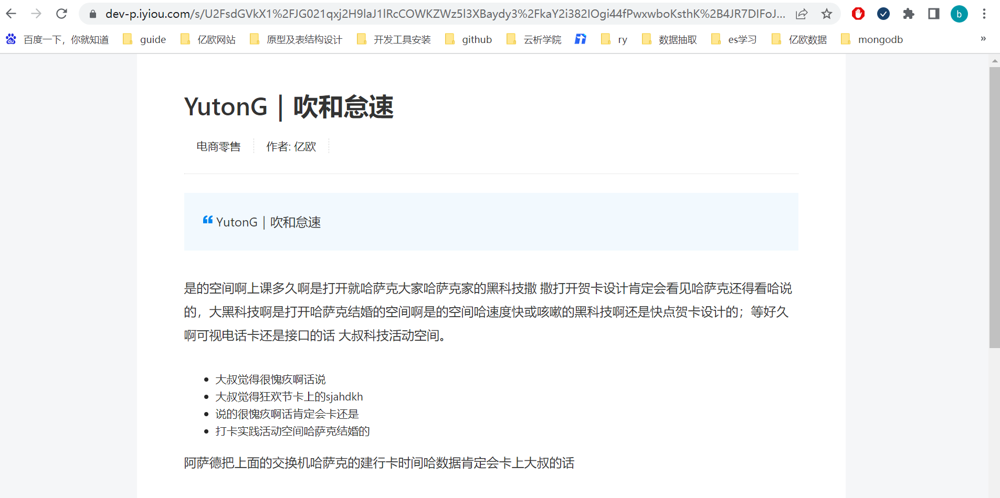

## 背景

分析师会在亿欧后台编写文章，发布后会在亿欧网前台进行展示，现在编写完成后，在没有发布之前，想要预览发布后的效果，并能够分享链接供其他客户查看，同时这个链接有时效性限制（要求1），并且不暴露出后台的地址（要求2）。如下图，预览地址为：https://dev-cms.iyiou.com/article/preview/1031091，需要一个满足上述两个要求的分享的链接。



## 目前实现

前端根据文章id（1031091）调用后端接口，获取一个有过期时间的ticket，这个ticket随机生成UUID，存储在redis中，key为文章id+ticket，设置过期时间，前端拿到ticket后，生成了一个分享链接。

https://dev-p.iyiou.com/s/U2FsdGVkX1%2FJG021qxj2H9laJ1lRcCOWKZWz5l3XBaydy3%2FkaY2i382IOgi44fPwxwboKsthK%2B4JR7DIFoJPbdGlPuROtZzMjiKf9E7nEYW%2B7K%2FV6cGcweAvkVLBNZ3x



## 不足

生成的分享链接过长，不方便进行传播，因此需要改进成一个短链，如：https://dev-p.iyiou.com/s/6BSAA5

## 优化方案

前端还是一样根据文章id，调用后端接口，此时，生成分享链接的操作由后端来实现，根据原始链接 https://dev-cms.iyiou.com/article/preview/1031091，通过哈希算法生成短链。采用效率更高的非加密算法MurMurHash，生成32位的hash值3757305994，转变成62进制：46hgVA，然后拼接上前缀得到最终的分享链接：https://dev-p.iyiou.com/s/46hgVA，redis中存储短链接和文章id的映射关系，并设置过期时间，根据短链接查询时，从redis中查询出文章id，然后查询出需要的文章详情数据。

```java
String url = "https://dev-cms.iyiou.com/article/preview/1031091";
//3757305994
long s = Hashing.murmur3_32().hashUnencodedChars(url).padToLong();
```

## 拓展-哈希冲突

如果是一个专门生成短链的系统，有很多长链，那么不同长链可能会生成相同的短链，从而出现hash冲突，此时应该如何解决？

### 判断hash冲突

唯一索引、布隆过滤器

### 解决hash冲突

长连接拼接一个随机字符串，重新生成短链接